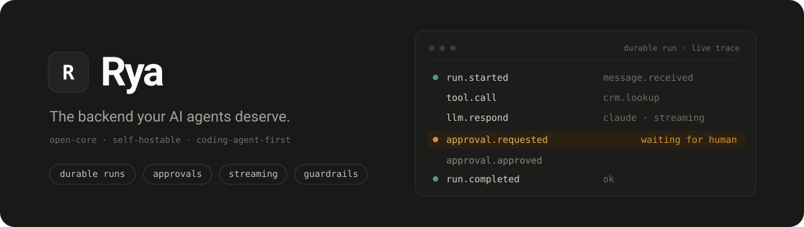
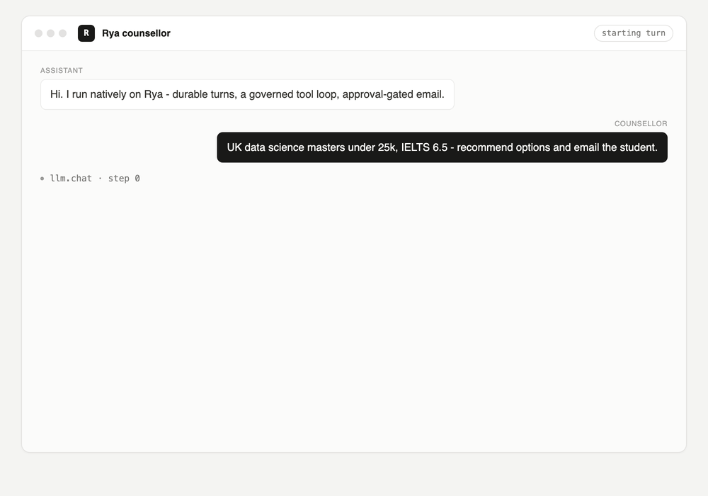

<div align="center">



<br/>

[](LICENSE)
[](pyproject.toml)


**[Quickstart](#quickstart) · [Why it's different](#why-it-feels-different) · [Docs](docs/DEEP_DIVE.md) · [Deploy](deploy/AGENTS.md) · [Repository map](src/rya/AGENTS.md)**

<br/>



</div>

---

> Durable runs, human approvals, memory, tools, guardrails, and observability -
> as primitives, not plumbing you rebuild every time. From prompt to
> production-grade agent backend in an afternoon.

You declare what an agent may do. The runtime enforces it, makes it durable, and
streams it live. Here is a complete agent:

```python
from rya import define_agent

agent = define_agent()

@agent.on_event
async def handle(ctx, event):
    ticket = await ctx.tools.call("crm.lookup", {"email": event.payload["email"]})
    reply  = await ctx.llm.respond(system="Draft a refund reply.", input=ticket)

    # pauses the run - durably, for days if needed - until a human approves
    await ctx.approvals.request(
        title="Issue refund", body=reply.text,
        action={"tool": "refund.issue", "input": {"ticket": ticket["id"]}},
    )
    await ctx.channels.send("email", {"to": ticket["email"], "body": reply.text})
```

Every `ctx.*` call is journaled. So this run survives a crash, resumes exactly
where it paused, streams token-by-token to your UI, and leaves a full audit
trace - and you wrote none of that.

## Quickstart

```bash
uvx rya create support-agent && cd support-agent
rya dev --check                                           # validate + inspect. no keys, no database
rya events send --type message.received \
  --payload '{"email":"ada@example.com"}'                 # run pauses for approval
rya approvals approve <id>                                # resume; the email is sent
```

`rya dev` (without `--check`) starts the real thing locally: an `api` process
and one `worker`, the same two processes as production, with the working tree as
the bundle.

Offline it uses a mock model, so this just works. Set `ANTHROPIC_API_KEY` for
real Claude, `RYA_DATABASE_URL` for durable Postgres - the same agent code runs
on a laptop, a self-hosted box, and the cloud.

## Why it feels different

- **Approvals actually pause the process.** A human gate is not a prompt
  convention - `ctx.approvals.request` unwinds the coroutine, persists, and
  resumes in another process by replaying the journal. The model never sees a
  gated tool.
- **The model can act, sandboxed.** `ctx.llm.run` lets the model call tools in a
  loop - and every call goes through the same permissions, scoped credentials,
  egress firewall, and audit as your own code.
- **Governance the runtime enforces, not the prompt.** Permission tiers,
  server-side argument pinning, runtime kill switches, an egress firewall, and a
  grounding gate that blocks any number the agent did not get from a tool.
- **Durable chat, durable jobs.** Chat turns are leased and crash-reclaimed with
  resumable token streams; the queue runs background work in any language with
  retries and dead-letter. An interrupted turn is retried, not dropped.
- **Coding-agent-first.** Claude Code, Codex, and Cursor drive the whole thing
  over a CLI (`--json` everywhere), an MCP server, and skills - and `rya deploy
  --check` is a green checklist they satisfy so they ship something safe.
- **Yours to run.** Open-core, self-hostable, offline-capable. No SDK lock-in for
  callers: any app talks to it over HTTP.

## Ship it

```bash
rya deploy --check              # readiness gate: missing evals, ungated actions, secrets in the repo...
rya deploy --env prod           # bundle + record an immutable version + promote
rya rollback --env prod         # a pointer flip back
```

From a **client repo** — one that installed only the `rya` SDK and has no database
or bucket access — the same pipeline runs over HTTP:

```bash
rya login https://rya.yourco.com --key rya_sk_…
rya publish --env prod          # content-hash + upload + record + promote
```

The platform rebuilds the hash from the bytes it received and refuses a mismatch,
so the content is the address either way. What `publish` cannot do is attest
readiness — see the honesty list below.

A deploy bundles your source, lockfile, manifest and SDK version into an
**immutable, content-hashed version**, records it, and flips the environment's
current-version pointer. New runs go to the new version; in-flight runs finish
on theirs, and a version is retained while any run is still pinned to it — a
run can only be replayed against the code that wrote its journal.

```bash
rya versions list               # every version, newest first
rya envs list                   # what each environment points at
rya bundle                      # just the content hash — the CI "did anything change" check
```

**Gate what reaches production.** A promotion gate is a server-side admission
check, not a client-side courtesy: it refuses unless *evidence* exists that the
checks passed against **this exact content**.

```bash
rya gate set --env prod --require-readiness --require-evals --require-provenance gitSha
rya eval --attest               # files the result against the version under test
rya promote --env prod --version <id>
```

Evidence is bound to the version, so a green eval run on a different tree cannot
admit this one. Rollback is deliberately never gated — a missing attestation must
not hold an outage open. `--force` works and is recorded against the version.

**Bound what a workspace can consume.** Quotas are admission checks too, so an
exhausted budget refuses the *next* run rather than killing one mid-journal:

```bash
rya quotas set --max-concurrent-runs 10 --max-cost-usd-per-day 25
rya quotas show                 # consumption against each ceiling
```

The platform runs as **two processes**, both the same image against the same
Postgres:

```bash
rya serve      # api    — REST/WS/SSE, auth, policy, guard, vault, console, MCP
rya worker     # worker — loads the bundle, owns the journal, executes handlers
```

They are run modes, not microservices: one deployable, one database, no
service-to-service call — they coordinate through the queue. On the durable path
(`POST /agents/{id}/turns`) the api process executes no handler code, which is
what makes per-tenant isolation mean something — though two routes still bypass
that, see below. Deploy both with the AWS IaC in [`deploy/`](deploy/AGENTS.md) or
`docker compose`.

## Install

Two distributions, and they are **alternatives, not halves** — both own the `rya`
import namespace, so install one or the other:

```bash
uvx rya create my-agent                           # zero-install: scaffold + run
pip install rya                                   # client SDK: build an agent in your repo
pip install 'rya-server[api,mcp,postgres,llm]'    # the platform: serve, worker, console, store
```

A client repo needs `rya` and a deploy token. It never imports the runtime, never
runs a server, and never knows which deployment it is running in — `ctx` is
implemented by the platform, at the platform's version, which is what stops
governance being forked or pinned by a client. The SDK ships `ctx` type stubs so
your handlers still type-check. See [packaging](docs/PACKAGING.md).

## Learn more

- **[Repository map](src/rya/AGENTS.md)** - the codebase, module by module. Every
  directory has an `AGENTS.md` written so a coding agent can orient fast.
- **[Deep dive](docs/DEEP_DIVE.md)** and **[primitives](docs/primitives.md)** -
  the full picture and every `ctx.*` primitive.
- **[MCP setup](docs/mcp.md)** - point Claude Code / Cursor at Rya.
- **[TypeScript SDK](docs/typescript-sdk.md)** - drive the platform from TS/JS:
  events, resumable turn streams, approvals, and the SDK-free durable job API.
- **[Packaging](docs/PACKAGING.md)** - `rya` vs `rya-server`, and the enforced
  boundary between them.
- **[End-to-end test](scripts/AGENTS.md)** - `python scripts/e2e_platform.py`
  builds both wheels into two separate virtualenvs, authors an agent with only
  the SDK, and runs it on a real `api` + `worker` pair: bundle handoff, promotion
  gate, durable approval, crash-resume in a different process.
- **[Langfuse](docs/langfuse.md)** - self-host it in one compose; every run and
  eval score lands there, deep evals via DeepEval.
- **[RWAP on Rya](docs/integrations/rwap.md)** - running a visual agent builder's
  workflows on Rya's durable queue (architecture + AWS).

Honest about maturity. Everything above runs today, and the durable-execution
primitives are correct and tested but young — not yet load-tested at high volume.
Specifically not done:

- **No managed cloud.** Self-host it; that is also what makes self-hosting a
  residency control.
- **Publishing over HTTP cannot attest readiness.** `rya publish` uploads a bundle
  to `POST /agents/{id}/versions` and needs neither the database nor the bucket, so
  a client repo with only the SDK can ship. But the control plane does not import
  bundles (D13), so it cannot evaluate readiness and files no attestation — the
  response says `"attested": false`, and an environment gated on
  `--require-readiness` will refuse the version. There is also no
  `rya attest readiness`, so `rya deploy --env` from a machine with `rya-server`
  remains the only way to satisfy that gate.
- **The AWS mutator Lambda is a pattern, not an implementation.** It returns 501
  by design rather than pretending; see [`deploy/aws`](deploy/aws/README.md).
- **Two routes still execute handler code in the api process.** `POST
  /agents/{id}/events` runs the handler inline — with zero workers alive, ignoring
  `RYA_API_INLINE_WORKER=0`, and unpinned (against the api's working tree rather
  than the promoted content-hashed bundle). `POST /approvals/{id}/approve` resumes
  a paused run the same way. The durable turn path is correct; these are not.
  `python scripts/e2e_platform.py` asserts all of this as open GAPs.

  `rya publish` makes the approval half of this sharper rather than worse: the api
  imports its mounted entrypoint once at startup, so once a bundle can be published
  from somewhere else, the code resuming an approval can differ from the code that
  paused it — including by nothing more than an edit made after the api booted. It
  **fails closed**: the journal's content keys stop matching and the run ends
  `E_JOURNAL_DRIFT` (D9) instead of replaying against drifted code. Restarting the
  api on the promoted bundle clears it. Approvals belong on the worker.
- **Crashed workers are still reported `alive`.** `lastHeartbeatAt` is written and
  never read, so `GET /workers` overstates the fleet after a SIGKILL.
- **Node isolation is an accepted residual.** Process isolation plus RLS contains a
  buggy tenant, not a hostile one — workers share a kernel.
- **`rya serve` is one agent per deployment.** `build_app` resolves a single
  `rya.agent.yaml` at startup, so the routes accept an agent id in the path but
  resolve the manifest's own name — the workspace → agent → environment tree is one
  agent wide. `rya publish` is where this stops being cosmetic: it refuses a bundle
  declaring a different name, because a version filed under a name this deployment
  does not serve would be listed by nothing and run by nobody. A second agent means
  a second deployment (its own api, worker and manifest); they can share one
  Postgres and one bundle store. See [docs/architecture.md](docs/architecture.md).
