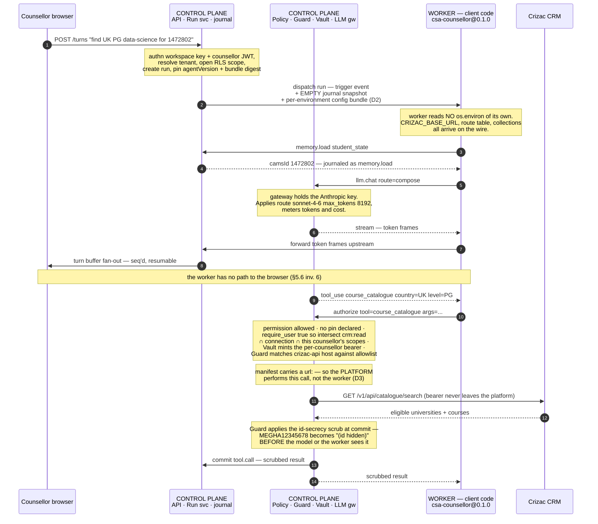
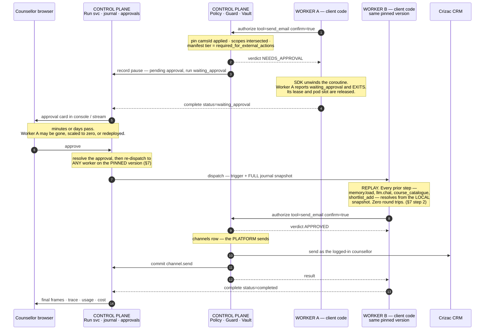
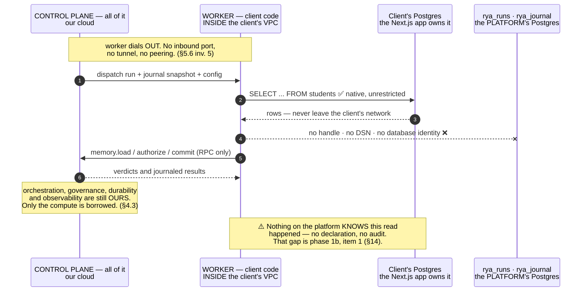

# Rya as a Platform — High-Level Design

**Status:** proposal / RFC · **Date:** 2026-07-27 · **Scope:** architecture only, no implementation

Rya today is a *library you build an agent inside of*. This document designs the
shift to Rya as a *platform your agent runs on* — the Trigger.dev / Prefect /
Temporal shape: a deployable runtime platform plus a thin client SDK, where the
client code lives in its own repository, on its own release train, and is
executed by the platform regardless of where it was written.

### Settled decisions

Recorded as they are agreed, so a reader can tell what is decided from what is
still up for debate. **All 21 are now settled, and every open question in §15 is
closed** — what remains there are named residuals (values to tune, sub-mechanisms
to design) rather than unresolved forks. Where a decision knowingly overrides an
earlier one, or accepts a cost, the row says so rather than smoothing it over —
D19 revising D5's "a laptop needs no database" corollary is the clearest case.

| # | Decision | Why it matters | Detail |
|---|---|---|---|
| **D1** | Split the platform/SDK boundary at the **policy** layer, not the store layer | a governed decision must not ship inside a client-versioned artifact. This is a *coupling and versioning* constraint, not a trust one — see §4.4 for how Temporal, Prefect and Trigger.dev all land in the same place | §3, §5.4, §7, §11, §14 phase 0 |
| **D2** | A run's config/secrets are **platform-delivered**, never read ambiently from the worker's process | kills the "works on my machine" bug class — which is live in this codebase today | §7, §9 |
| **D3** | Push tool implementations toward **platform-resolved `url:` tools** wherever a tool is a pure HTTP call | collapses egress parity, thins workers, removes round trips | §7 |
| **D4** | **Journal-diff conformance** is the parity test; pool binding is **explicit, with no fallback** | parity becomes a CI diff; a prod run can never execute on a dev laptop | §5.2, §11 |
| **D5** | **One worker model everywhere.** Every worker — our cloud, the customer's cloud, a laptop — talks to a control plane over the protocol. No worker ever runs against a local store, and the SDK ships **no control-plane emulation**. The store seam survives *inside the platform* — though **D19 has since chosen Postgres for the local platform anyway**, so the "a laptop needs no database" corollary no longer holds in practice | removes the last exception to D1: parity stops being "structural except for the offline tier" and becomes structural, period. Kills the second implementation before it gets written | §3, §5.3, §10, §11.1 |
| **D6** | **`rya` on PyPI is the client SDK; the platform ships as `rya-server`.** The `rya` console script belongs to the *author*, so `uvx rya create` survives verbatim. Operator commands move to `rya-server serve` / `rya-server worker`. Both names get reserved immediately | the only irreversible decision in this RFC, and it goes to the audience the funnel advertises to. Matches Temporal (`temporalio` SDK, server as a separate distribution) and Trigger.dev; operators deploy an image, so the platform's PyPI name is near-cosmetic | §13, §14 phase 2 |
| **D7** | **Leaf credentials in three layers: prefer platform-injected `url:` tools, lease what remains, and keep raw hand-off only as a journaled, expiring exception for static-key upstreams.** Invariant 2 is restated as *no **long-lived** platform-issued credential* | makes invariant 2 enforceable instead of aspirational, without deleting the mechanism CSA's live Crizac surface runs on. Unblocks phase 1b | §5.6, §6, §14 phase 1b, §15 |
| **D8** | **The south-bound protocol is schema-first, carried over WebSocket+JSON.** The wire contract is a schema checked in CI; the transport is WS frames. gRPC stays a later *transport* swap under the same schema, not a rewrite | separates the two things gRPC bundles: the machine-checked contract (which mitigates risk #2 on day one) from HTTP/2 ingress (which is a liability when the path runs through a customer's network). Keeps a non-Python worker writable without codegen | §7, §13, §15 |
| **D9** | **Multi-tenant control plane, per-customer execution pools.** Many workspaces share one operated control plane, isolated by Postgres RLS; every customer's *code* runs in a pool dedicated to them. We do not co-tenant execution | separates the two things "multi-tenant" was conflating — multi-tenant *state* (a DB-enforced boundary, already built in `tenancy.py`) from multi-tenant *code execution* (a sandbox-escape problem we have no posture for, risk #6). Costs nothing architecturally: §4.1's pool model already expresses it | §4.1, §4.3, §9, §15 risk 6, P2 |
| **D10** | **Apache-2.0 for both halves**, with copyright kept consolidated (in-house contributions or a CLA) so a source-available relicence stays available if a hosting threat ever materialises | matches every platform this RFC models itself on — Temporal (MIT), Prefect and Trigger.dev (Apache-2.0) — none of which uses BSL; the moat is the operated service. Critically, a permissive platform is what keeps D9's self-hosted tier free of a procurement conversation on every deal | §13, P3 |
| **D11** | **The mutator-Lambda architecture is absorbed, not abandoned.** Authorize/commit RPC succeeds the per-operation Lambda; the control plane's commit path connects as a **distinct write-privileged DB role**, separate from the read path; JWT-claim-keyed RLS stays a tracked hardening item | keeps the privilege-separation property that made the pattern worth building, drops the AWS coupling that D9's on-prem tier cannot carry, and removes an XL roadmap item. Avoids two authorization implementations, which §7 forbids | §7, §9, and the dropped-commitments note below |
| **D12** | **Two named product surfaces: the agent platform and the durable job API.** `/queue/*` stays SDK-free and first-class for foreign code (RWAP), with no per-step governance; the agent protocol governs code-executing workers. A **queue job is not a governed run**, and §9 says so | they were never one thing: RWAP's workers run TypeScript DAGs with no journal and nothing to authorize. Naming both costs less than merging them — we already maintain both — and merging would push a live integration toward its trigger.dev alternative | §4.1, §7, §9, and the dropped-commitments note below |
| **D13** | **A retry re-authorizes.** Each attempt re-resolves permission, scope and credential; authorization records live in the **trace, not the journal** | makes a kill switch effective at attempt granularity instead of outrunnable by a backoff timer. Keeping authorizations out of the journal is what makes this free: D4's journal-diff is unaffected (retries are already traced, never journaled), and the extra RPC lands inside a backoff we are already waiting through | §7, §11.3 |
| **D14** | **One environment-invariant manifest per agent.** The manifest describes *the agent*; platform config describes *the deployment*. The inert `environment:` field is **deleted**, becoming a promote-time assignment | forced by two decisions already made: §8 promotes one content-hashed bundle *between* environments, which an environment-specific manifest makes impossible; and D4's journal-diff is only meaningful if both sides are the same agent. Consequence to fund: platform config must be versioned, diffable and audited, because egress allowlists and model routes leave the client's PR | §7, §8, §11.3, §14 phase 0 |
| **D15** | **Payloads travel inline by default; above a size threshold they spill to an object-store reference that the platform proxies.** The worker never reaches the object store directly | matches the measured sizes (memory blocks truncate at 2000 chars; result sets cap at 5) and reuses `files_s3.py`, which already does this for files. Proxying is the load-bearing part: it keeps a self-hosted worker's dependency surface at one outbound connection, instead of requiring S3 reachability and a credential inside a customer's network | §7, §12 |
| **D16** | **Billing: governed runs are the primary unit, model tokens are metered as a separate line, worker-seconds apply to managed pools only.** Metered facts are **journaled, not traced**, and prices are **platform config, never a worker's environment** | the only shape that prices both of D9's pool kinds — a self-hosted customer consumes the control plane but none of our compute. The journaling and pricing clauses are the load-bearing half: today `run_usage()` reads `run["trace"]` and `_price()` falls back to `os.environ`, which would let a worker's environment influence an invoice | §7, §9, §12 |
| **D17** | **Data residency is deliberately deferred: no region concept.** One control plane, one region, sold to customers for whom that is acceptable. Accepted cost, recorded rather than softened: retrofitting residency across 11 tables and a shared multi-tenant control plane is materially more expensive than pinning workspace→region up front, and this hard-blocks the first regulated deal | an explicit "not yet," which is a legitimate answer and better than a half-measure that would be mistaken for compliance. The one clause that is *not* deferred, because it costs nothing and prevents a false compliance story: **self-hosting a worker is not a residency control** (see §9) | §9, §15 |
| **D18** | **`rya dev` auto-starts the local platform; `rya dev --check` preserves today's instant validate** | keeps the quickstart at one command without silently regressing a command that CI and tight edit loops depend on being fast — today's `rya dev` (`cli/main.py:244-270`) validates and exits in milliseconds | §10 |
| **D19** | **The local platform runs on containerised Postgres, not `FileStore`.** Docker becomes a quickstart prerequisite | chooses execution-plane parity over frictionless setup: `FileStore` cannot exercise RLS or real concurrency, and because neither is journal-visible, **D4's journal-diff provably cannot detect their absence** — so a FileStore local platform would leave the tenancy/concurrency bug class to surface first in production. **Accepted cost:** the "no database" half of the quickstart is retired, revising D5's corollary and §10's promise; local startup goes from milliseconds to seconds. Revisit this, not D5, if the inner loop erodes | §5.3, §10, §14 phase 1, §15 risk 4 |
| **D20** | **The mounted-`/project` mode survives, but the mounted tree gets a content hash at worker registration.** A mid-run change to the tree makes the worker fail closed rather than replay against different code | keeps `docker-compose.yml`'s self-host workflow (`:50-52,63-64`) while closing a real correctness hole: a mounted directory has no bundle digest, so §5.2 registration has nothing to report and D4 has nothing to pin. Hashing costs nothing at these sizes and turns an unsupportable topology into a first-class one | §5.2, §8, §10, §15 risk 3 |
| **D21** | **The protocol contract is expressed in JSON Schema**, validated in CI and at runtime | native to D8's wire format, so no build step, no codegen, and validation is one library call in any language — which is what makes a non-Python worker cheap (`ajv` and done). **Honest cost:** protobuf has no faithful JSON Schema import, so D8's "gRPC stays a later transport swap" is not free — it would mean hand-translating ~35 message families. The swap remains available, but at a price that should be stated rather than assumed | §7, §13 |

Residuals and tracked follow-ups are collected in §15.

### Positioning deltas — six commitments this RFC overrides

The six below are **product decisions** that this RFC originally made *implicitly*,
by contradicting something the repo, the docs, or the public site already commits
to. They were listed so they would get decided deliberately rather than absorbed.
**All six are now settled** — P2, P3 and P6 by their own decisions (D9, D10, D6),
and P1, P4 and P5 as consequences of decisions taken elsewhere. Each row records
what the repo still says, so the follow-up edits are a work list rather than an
archaeology exercise.

| # | Committed today | What this RFC implies | Status |
|---|---|---|---|
| **P1** | `architecture.md:11-12` — "**the store is the seam** that makes one codebase serve every tier," with `ctx`/`engine` holding the store handle | D1: the worker never touches the store; the seam is policy. **But D5 softens this** — the store seam survives *inside the platform* (§5.3), so `architecture.md`'s idea was right and merely one layer too high | **Resolved as a consequence of D5 + D19** — no separate decision needed. The seam is relocated, not deleted: `open_store()` moves below the policy boundary, and D19 then scopes `FileStore` to hermetic tests while the local platform runs Postgres. `architecture.md:11-12` needs rewriting to say the seam is *the platform's*, and it can no longer claim it "makes one codebase serve every tier" in the sense of a laptop needing no database |
| **P2** | `site/index.html` — "**We do not run a multi-tenant SaaS.** Each customer gets a dedicated deployment inside their own account"; `deploy/aws/template.yaml:3-9` — "no shared blast radius" | a *managed* pool is the default pool kind (§4.1) | **Decided — see D9.** First, a precision the earlier draft missed: the site claim is about what we *operate*, not what the software can do, so `tenancy.py` — which says outright it "makes one deployed agent serve many isolated customers," with RLS + `FORCE` + a non-superuser `rya_app` role — does **not** falsify it. What this RFC falsifies is narrower: operating a *shared* default pool. D9 splits the claim along the boundary that carries the risk: the **control plane** is multi-tenant (DB-enforced RLS), **execution is not** (a pool per customer). So "no shared blast radius" survives where it means most, and the sentence that must change is "a dedicated deployment inside their own account" — the control plane is shared and in our account, and it holds the journal, the sealed connections and the policy state |
| **P3** | `architecture.md:96-105` draws OSS-core vs proprietary-cloud; `LICENSE` grants Apache-2.0 (irrevocably) over *all* of `src/rya`, including `guard.py`, `seal.py`, `tenancy.py` — the very modules that diagram labels proprietary. `architecture.md:107` already admits the licence is "a product decision, not yet committed" | §13's repo split cuts by *who executes*, moving guard / seal / policy / store / providers platform-side | **Decided — see D10.** And a correction to this row's own premise: the earlier draft said the Apache grant was already "perpetual and irrevocable for today's code." It is not. A copyright licence takes effect on **distribution**, and `plexe-ai/rya` is private (`rya-agent/pyproject.toml:33` says so explicitly) with nothing published to PyPI — so the grant has been extended to essentially no one outside the org and full relicensing freedom survives. *Not legal advice; confirm with counsel before relying on it.* The freedom has a hard deadline, though: D6's first public artifact **is** the act of granting, so P3 had to be settled before that step, not after. Two follow-through items: resolve the layer-map contradiction where `tenancy.py` sits in the OSS-core box while the diagram labels multi-tenancy proprietary, and keep copyright consolidated so the source-available option stays open |
| **P4** | `README.md:93-95` — "`rya serve` is the whole product in one process… the hosted instance **is** `rya serve`" | control plane and execution plane are separate deployables | **Resolved by the RFC itself plus D20** — no separate decision needed. The claim is superseded: §1 uses that sentence's subject as its problem statement. The live remnant was whether the single-node mounted-`/project` shape survives, and D20 keeps it *with a content hash*, so "platform + colocated worker" stays a real topology — it just stops being "the whole product." `README.md:93-95` needs rewriting; `docker-compose.yml` needs its store handles and `x-rya-env` block reworked per D1/D2 |
| **P5** | `README.md:61-63`, `langfuse.md:37` — set `ANTHROPIC_API_KEY` / `RYA_DATABASE_URL` / `LANGFUSE_*` and the same code runs everywhere | D2: ambient env is not a run input | **Resolved as a consequence of D2, D14 and D16** — no separate decision needed. The documented mechanism becomes a readiness-gate finding. D14 adds that per-environment values live in platform config rather than in the manifest, and D16 adds the sharpest instance: `_price(model, "IN", env)` falling back to `os.environ` (`observability/usage.py:27`) would let a worker's environment influence an invoice. Docs to rewrite: `README.md:61-63`, `langfuse.md:37`, and `docker-compose.yml`'s `x-rya-env` |
| **P6** | `rya` on PyPI is the package an *agent author* installs — `uvx rya create` in `README.md:54` and on the site. **The publish is still pending sign-off** | `rya` becomes the platform package (keeps `api`/`postgres`/`llm`/`mcp`); `rya-sdk` is the client one | **Decided — see D6.** No inversion: `rya` stays the author-facing package, so `uvx rya create` and the site copy are untouched. The platform becomes `rya-server`, carrying the `api`/`postgres`/`llm`/`mcp`/`bedrock` extras. Two follow-through items: (a) reserve both names on PyPI now, before the split lands, since the residual risk is a third party taking `rya-server`; (b) `rya serve` → `rya-server serve` breaks `deploy/aws/Dockerfile.project:20` and the deploy runbooks — bounded, all in repos we own |

**Two commitments this RFC currently drops in silence** — both need an explicit
verdict rather than omission:

- ~~**The Cognito / API-Gateway / per-mutator-Lambda architecture.**~~
  **Resolved as D11: the intent is absorbed, the packaging superseded.**

  First, a correction to this row's earlier claim that `deploy/aws/template.yaml`
  "already implements it (cfn-lint clean)." The resources are declared and the
  template does lint clean, but it calls itself a **"reference posture"** (`:5-7`)
  and `MutatorFunction` (`:354-367`) is a **stub** — its body is the comment "In
  production: verify the Cognito JWT from the request, open a DB…" followed by
  `return {"ok": True, "pattern": "single-purpose-mutator"}`. `VISION_GAP.md:134-136`
  concurs, listing "no Cognito, no API Gateway, no per-mutator Lambdas" as the gap
  at **XL**, "needs an AWS account and is multi-session." Superseding it therefore
  costs far less than the earlier wording implied.

  The name covers four separable claims, and they do not share a verdict:

  1. **Per-request user JWT identity** — *kept, and already partly built.*
     `tenancy.py:140,153` has per-user RLS on `runs` and `conversations`; the
     runtime carries `identity.sub`/`identity.scopes` from a signed
     `X-Rya-User-Token`, and `_authorize_connection` fails closed with
     `E_NO_IDENTITY` rather than falling through to a workspace-shared credential.
  2. **RLS keyed to the verified JWT claim** (`current_setting`) — *kept as a
     separately tracked control-plane hardening item.* Orthogonal to where code
     executes, so nothing in this RFC bears on it either way. Keeping it is the
     point: it is the genuinely differentiating half, and discarding it merely
     because it arrived attached to a Lambda would be the wrong trade.
  3. **The single-purpose privileged mutator** — *intent absorbed, packaging
     superseded.* The property being bought is **privilege separation**: the
     general-purpose runtime cannot perform privileged writes; only a narrow,
     audited component can. §7's authorize/commit RPC has the same shape at
     different granularity (one policy service, not one function per operation)
     but on a weaker substrate — a process boundary plus policy code, versus IAM
     plus a distinct DB role. **Refinement that recovers most of the difference
     portably:** the control plane's *commit* path connects as a distinct
     write-privileged Postgres role, separate from the read path. Same security
     property, no AWS coupling, works on-prem — which D9's self-hosted tier
     requires and a Lambda cannot provide.
  4. **Plane separation in deployment** — *superseded outright*; it is what this
     RFC delivers, by other means.

  Rejected: *keeping both* (two write paths means two authorization
  implementations, exactly what §7 forbids, and it pins the highest-risk path to
  AWS); and *keeping the Lambda as the real write path* (hard-couples the platform
  to AWS against §2's on-prem claim, and it is XL greenfield on the critical path).
- ~~**RWAP**~~ — **Resolved as D12: two named surfaces, not one protocol stretched
  over two products.** The earlier framing ("does the SDK-free HTTP path survive?")
  treated `/queue/*` as an alternate way of *being a worker*. It is not.
  `rwap.md:38-40` is explicit: RWAP's worker "runs the workflow's **TypeScript
  DAG**," and Rya wraps durability *around foreign code* — no `RuntimeContext`, no
  `_step` memoization, no per-step journal, and therefore **no policy decision to
  authorize**. `/queue/*` is a different product that shares a store, not a
  degenerate worker protocol.

  This also corrects "§4 leans on `queue.py` as its foundation," which conflated
  two separable things: `queue.py`'s lease / retry / DLQ / idempotency **mechanics**
  (genuinely reusable, and good) versus its **worker contract** (which is not, and
  never will be, the agent-worker contract — there is nothing to govern).

  What made this urgent rather than academic: `rwap.md:17-20` notes the `rya`
  backend is "one option alongside its database and **trigger.dev** backends, so
  adopting Rya is a config switch, not a rewrite." Any friction we add is answered
  by selecting a different backend. Folding `/queue/*` into the worker protocol was
  therefore rejected — D8 makes a TypeScript handshake genuinely feasible, but the
  work lands on RWAP to retain something that already works, against a one-value
  alternative.

  Two consequences to carry elsewhere in this document: §9 must state explicitly
  that **a queue job is not a governed run** — it receives none of D1's guarantees,
  and leaving that ambiguous is worse than either answer; and RWAP's workers should
  stop being described as a "pool" in §4.1's sense, since they are self-hosted by
  definition and execute non-rya code.

---

## 1. Where we are today

```
chatstudyabroad/rya-agent/            rya (the whole product)
  pyproject.toml ──── git pin ──────► plexe-ai/rya @ track-a-core
  rya.agent.yaml                        src/rya/{sdk,runtime,api,tools,...}
  src/agent.py  (3k lines, 26 tools)    `rya serve` = API + console + engine + MCP
  Dockerfile  ──► uv sync --extra deploy ──► CMD rya serve   (one process, one project)
```

The agent is not *deployed to* Rya; it is *compiled into* a Rya. The image
contains the runtime and the client code, `rya serve` is rooted at a directory
that must contain `rya.agent.yaml`, and `runtime.load_agent()` imports the
entrypoint from the local filesystem into the server process.

Consequences we are already paying for:

| Symptom | Root cause |
|---|---|
| `rya = { git = ..., branch = "track-a-core" }` | no released client contract; the client pins the *whole product* |
| A runtime fix requires rebuilding + redeploying every client image | runtime and client share a build artifact |
| One `rya serve` = one agent project | the process *is* the deployment unit |
| Client code runs in the control-plane process | no isolation boundary; cannot host untrusted or multi-tenant code |
| Each new client would fork the same Dockerfile/compose/IaC | no deployment pipeline, only a container recipe |
| A run cannot be resumed by a differently-versioned process | code version is a property of the image, not of the run |

What we *do* already have, and should not rebuild — most of a control plane:

- durable runs with journal + replay-based pause/resume (`runtime/engine.py`, `sdk/context.py`)
- a lease-based, retrying, dead-lettering job queue explicitly designed for
  **external workers in any language** (`queue.py`) with a TS worker loop already
  written (`clients/typescript`)
- durable, resumable, reclaimable chat turns over that queue (`turns.py`)
- multi-tenancy: workspaces, hashed API keys, Postgres RLS (`tenancy.py`, `store_postgres.py`)
- governance: permission tiers, kill switches, server-side arg pins, scoped
  credentials, egress firewall + grounding gate (`guard.py`), secret sealing (`seal.py`)
- observability: traces, token/cost usage, Langfuse/OTLP export
- a remote-control client and credential store (`cloud.py`), REST/WS/SSE/MCP surface

**The gap is not the control plane. It is the execution plane and the client
contract.** Roughly: we have ~70% of a platform and 0% of a deployment pipeline.

---

## 2. Target model

```
┌── client repos (independent, any language, any release train) ────────────────┐
│  chatstudyabroad/rya-agent      acme/support-agent      internal/ops-agent    │
│  depends on: rya-sdk ^1.x  (thin, published, semver'd)                        │
└──────────────────────────────┬────────────────────────────────────────────────┘
                               │  rya deploy  (bundle + manifest → version)
                               ▼
┌── Rya Platform (k8s; SaaS, on-prem, or single-node) ──────────────────────────┐
│  CONTROL PLANE   API · dispatcher · scheduler · approvals · LLM gateway ·     │
│                  guard/egress · vault · turn streams · console · MCP · evals  │
│  EXECUTION PLANE warm pools / per-run pods running *client* deployment images │
│  STATE           Postgres (runs, journal, queue, memory, tenancy) · Redis ·   │
│                  object store (bundles, artifacts) · registry · KMS           │
└───────────────────────────────────────────────────────────────────────────────┘
```

Three nouns, borrowed deliberately from the prior art:

- **Deployment** — an immutable, versioned artifact built from a client repo:
  code bundle + `rya.agent.yaml` + lockfile + SDK protocol version.
- **Environment** — `dev` / `staging` / `prod` within a project; each holds one
  *current* deployment version plus any older versions still pinned by live runs.
- **Worker pool** — where deployments execute. `managed` (platform-run, the
  default) or `self-hosted` (client-run pods that dial out). Same protocol.

The promise, stated as a contract: **a client repo needs the SDK and a deploy
token, nothing else. It never imports the runtime, never runs a server, never
knows whether it is executing on a laptop, an on-prem cluster, or our cloud.**

---

## 3. Principles

1. **The client SDK is a contract, not a dependency on our codebase.** Thin,
   published, semver'd, with a versioned wire protocol underneath it.
2. **Governance stays platform-side, and the seam is the policy layer. (D1)**
   Permissions, pins, scoped credentials, the Action Guard, kill switches, cost
   metering and the model keys are enforced by the platform, not by code the
   client controls. The split is made at the *policy* layer, not the *store*
   layer: a worker cannot make a governance decision because it does not carry
   the code to make one. Hand a worker a database connection and let it run its
   own policy, and parity is a testing problem forever; make every policy
   decision an RPC, and parity is structural. Note this is strictly *better*
   than today, where `ctx` **is** the policy engine, in-process, at whatever
   version the client happened to pin.
3. **Run inputs are declared, not ambient. (D2)** Config, secrets and
   connections are delivered to a run by the platform from per-environment
   state. Handler code reading `os.environ` is a readiness-gate finding, not a
   style preference (§7).
4. **One protocol for every execution topology.** Managed pods, self-hosted
   pools, and a laptop are the same worker speaking the same protocol at
   different addresses.
5. **Durability semantics do not change.** Journal + deterministic replay
   remains the model; we are moving the journal behind an RPC, not replacing it.
6. **A fast local loop matters — and it will not be a second control plane. (D5)**
   The zero-config, no-keys loop survives, but by running *the platform* locally
   rather than by emulating it in the SDK. One worker model, one control-plane
   implementation, no exceptions (§10).
7. **Every deployment is immutable and pinned per run.** Version identity is
   platform state, not an image tag someone overwrote.

**Non-goals for v1:** running arbitrary untrusted third-party code — and per **D9**
the sharper statement is that we are multi-tenant in the *state* layer across our
customers and never in the *execution* layer, so this is not a public
code-execution service and no customer's code shares a process with another's;
replacing Postgres as the state substrate; a visual builder; auto-migrating
in-flight runs across incompatible code versions.

---

## 4. The central decision: who executes client code

Everything else follows from this. Three coherent answers exist in the market.

| | **A. Platform-hosted** (Trigger.dev) | **B. Client-hosted workers** (Prefect/Temporal) | **C. Hybrid** |
|---|---|---|---|
| Where code runs | platform's cluster | client's infra | either, per pool |
| Deploy | upload → platform builds image | client builds + runs workers | both |
| Ops burden | platform | client | choice |
| Client-network data access | needs egress/peering | native | choice |
| Code/secrets leave client network | yes | no | choice |
| Build service, registry, sandboxing needed | yes | no | yes (later) |
| Distance from today's code | large | **moderate** — see the correction below | — |

**Recommendation: C, sequenced B → A.**

`queue.py` already gives external workers claim / lease / heartbeat / complete /
fail / retry / DLQ / concurrency caps, and the TS client already implements that
loop. **But an earlier draft of this section claimed the distance to B was
"small," and that was wrong.** `queue.py` is a queue for *opaque background jobs*
whose payloads a caller-supplied handler interprets; it has no relationship to
`RuntimeContext`, the journal, or replay. There is no worker registration, no
capability advertisement, and no "claim a run, receive its journal snapshot,
authorize → execute → commit per new step" flow. The only place a queue-claimed
job maps onto real agent-run execution is `turns.py:_run_turn`, and it does so
**in-process**, calling `engine.run_event(...)` with the store handle the caller
already has. So: the queue *mechanics* are done and genuinely reusable; the
store-less, code-executing worker is greenfield. B is still the right first step
and still far cheaper than A — it just isn't nearly free.

A is then a strictly additive statement: "the platform operates the worker pool
for you", reusing the identical protocol, plus a build service.

This also matches the on-prem story you want: an on-prem install is the same
platform with a managed pool inside the customer's own cluster.

### 4.1 The pool model

The hybrid works because **worker pool** is a first-class platform object and the
dispatcher is deliberately blind to what kind it is.

```
                    ┌────────────── CONTROL PLANE (one deployment) ───────────────┐
   trigger ────────►│ runs · journal · approvals · policy · LLM gateway · vault · │
                    │ traces · dispatcher                                         │
                    └───┬─────────────────┬─────────────────────┬─────────────────┘
  pool binding,         │                 │                     │
  per environment  ┌────▼─────┐    ┌──────▼──────┐      ┌───────▼────────┐
                   │ managed  │    │ self-hosted │      │ dev            │
                   │ our k8s  │    │ their k8s   │      │ one laptop     │
                   │ our build│    │ their build │      │ local code     │
                   └──────────┘    └─────────────┘      └────────────────┘
       all three: same SDK worker loop, same protocol, all dial OUT
```

A pool is a token, a set of registered workers, and lease health. Each worker
advertises `{protocol version, SDK version, bundle digest, runtime + arch,
registered handler ids}` at registration. The three kinds differ in only four
ways: who operates the process, where the code artifact comes from (registry
image vs. local files), worker lifetime and identity, and network position.
Nothing about run semantics differs.

**Under D5, `dev` is not a different kind of worker at all** — it is the same
worker, with local code instead of a pulled image, a short lifetime, and (usually)
a control plane running on the same machine. It stays listed separately here
because *routing* still needs the distinction (§4.2: a prod run must never land on
a laptop, and two developers must not steal each other's runs), not because the
execution model differs.

### 4.2 Routing (D4)

An environment binds to exactly one pool, and **there is no implicit fallback
between pools**. A saturated managed pool must never spill a `prod` run onto a
developer's laptop — that is a safety property, not a scheduling default. Dev
needs a finer routing key still: a dev pool is scoped to a single developer
identity, otherwise two engineers running local workers against the same project
steal each other's runs, and one person's approval resumes inside another's
uncommitted code.

### 4.3 Why both kinds exist

Not philosophy — your own repo is the argument. `rya-agent/src/students_store.py`
reads the same Postgres the Next.js app owns, and the Crizac client talks to an
internal CRM. That is a VPC-local dependency, which is the canonical reason a
client must host the worker: the data cannot move. (§5.6 invariant 1 is scoped so
this is explicitly *allowed* — the worker is barred from the **platform's** state,
never from the client's own.) Add data residency,
compliance, egress to internal systems, special hardware. Managed stays the
default because nobody wants to run ops and because we control the isolation
posture there.

**What "managed" means under D9.** A managed pool is dedicated to one customer,
not shared across them. The multi-tenancy is in the control plane — many
workspaces in one Postgres, isolated by RLS — not in the execution plane. So the
two pool kinds differ in *who operates the compute*, never in *whose code shares
a process*: nobody's ever does. This is what lets §9 keep a defensible version of
"no shared blast radius" without first solving sandbox escape (risk #6).

Be precise about what the promise survives. With a self-hosted pool the
*orchestration, durable state, governance decisions and observability* are still
the platform's; only the compute is borrowed, and the user-visible contract
(deploy a version, get runs, approvals, traces) is identical. What genuinely
weakens: a client can operate their compute badly — wrong image, no autoscale,
blocked egress — and the platform can only *detect* that, not prevent it. Hence
capability advertisement (§5.2) and per-pool health surfaced in the console.

### 4.4 Prior art: where the others cut

Read from their docs rather than from memory, because this decision is the one
most worth borrowing on.

| | Where code runs | Worker → DB? | Who owns state transitions | Local dev |
|---|---|---|---|---|
| **[Temporal](https://docs.temporal.io/encyclopedia/architecture/how-temporal-works)** | the customer's workers, *including on Temporal Cloud* | **never** — explicit in the docs | the Server: workers emit **Commands**, the History Service validates them into Events and persists | a worker on your machine against a server |
| **[Prefect](https://www.prefect.io/how-it-works)** | the customer's infra — "your code and data never leave your infrastructure" | **no** — workers *poll* the API; Prefect makes no inbound request into your network | the control plane: scheduling, state, orchestration rules; it receives "logs and state, never your data" | a worker process locally |
| **[Trigger.dev](https://mintlify.wiki/triggerdotdev/trigger.dev/how-it-works)** | their infra (supervisor + per-task containers) | via API | the platform: queue, run state, CRIU checkpoints, observability | [`trigger dev`](https://trigger.dev/docs/cli-dev-commands) runs tasks in a **local Node process** registered with the webapp |

Three conclusions:

1. **All three cut above the store; none hands the executing process a database.**
   Three independent teams, three different products, same boundary.
2. **Two of the three treat customer-run workers as the default, not an exception
   — and still do not ship state-transition authority to them.** Temporal Cloud's
   workers are *always* the customer's. Prefect sells the hybrid model as the
   enterprise posture. So "customer-hosted" is not a second-class or suspect
   topology; and yet neither concludes "therefore let the worker decide." The
   industry answer is *trusted workers, server-validated transitions* — not
   because workers are hostile, but because it is the only way one orchestrator
   serves many worker versions and topologies at once.
3. **Temporal kept determinism and replay SDK-side, and that is exactly where its
   well-known pain lives.** Non-determinism-on-replay errors, `GetVersion`
   patching, [Worker Versioning](https://docs.temporal.io/production-deployment/worker-deployments/worker-versioning)
   with Build IDs and Deployment Versions, and warnings that once an SDK option is
   enabled you cannot roll back to an SDK that lacks it. An entire product surface
   exists to manage the consequences of SDK-side replay logic. That is empirical
   evidence for putting *less* in the SDK — and it independently confirms §7's
   journal/version coupling risk, since Worker Versioning is precisely the
   mitigation proposed there.

**Where the analogy breaks — in our favour.** None of these three has Rya's
governance layer. Temporal has no notion of "the model may not call this tool", no
egress firewall, no grounding gate, no approval tier a caller cannot bypass. For
them, SDK-side logic is *bookkeeping*: wrong is annoying. For Rya the policy layer
is a *security boundary*: wrong means a student record written against the wrong
counsellor. Rya therefore has strictly more reason to server-side policy than the
three companies that already do.

**A note on framing.** "Untrusted worker" is the wrong justification and should
not appear in this design. The property that matters is not malice but **skew**: a
self-hosted worker is not hostile, it is eight months behind on the SDK; a laptop
is not adversarial, it has a stale virtualenv and a `.env` from March. Trust the
operator completely and every coupling argument above still holds. Corollary worth
keeping: **trust changes the performance envelope, not the authority boundary** —
a co-located managed pool can legitimately earn read-side fast paths (cached or
replica-served memory and knowledge reads) while every decision and every write
stays server-side.

---

## 5. Component architecture

### 5.1 Control plane (stateless, horizontally scaled)

| Service | Responsibility | Today |
|---|---|---|
| **API gateway** | REST/WS/SSE, auth (API key / JWT / OAuth), tenant resolution, rate limits | `api/app.py`, `tenancy.py` |
| **Run service** | run lifecycle, the journal, step commit + memoized replay, approvals | `runtime/engine.py`, `approvals/` |
| **Dispatcher** | matches ready runs/jobs to workers by (environment, version, pool, concurrency key) | `queue.py` (extend) |
| **Scheduler** | cron, delayed jobs, lease reaping, turn reclaim sweeps | engine cron + sweeper |
| **LLM gateway** | all model calls; routes, fallbacks, streaming, token/cost metering, prompt/response tracing | `providers/`, `observability/usage` |
| **Policy service** | tool permission resolution, kill switches, arg pinning, scoped-credential authorization | extract from `sdk/context.py` — logic exists and is tested, but inline in the file being thinned. Kill switches also need carving out of `load_memory("_runtime_config")`, an ordinary memory scope with no schema distinction from user data |
| **Guard / egress proxy** | outbound allowlist for tool + worker traffic, grounding gate | `guard.py` — a rewrite, not a promotion: policy loads from `cwd`/`RYA_GUARD_PATH` by file mtime, and `check_egress` is called from `_http_tool` *inside `sdk/context.py`* |
| **Vault** | connection secrets, per-user credentials, envelope encryption via KMS | `seal.py`, `ctx.connections` |
| **Stream service** | durable turn buffers, fan-out to UI clients, resume by `Last-Event-ID` | `turns.py` |
| **Build service** | bundle → image → registry → version record (phase 3+) | — |
| **Console / MCP** | operator UI, remote MCP for coding agents | `console/`, `mcp/` |

Splitting these into separate deployables is a scaling decision, not an
architectural one — they can start as one binary with feature flags (as `rya
serve` is today) and be pulled apart along these seams. §5.4 gives the same
picture cut by *concern* rather than by service, which is the more useful view
when arguing about where a given behaviour belongs.

### 5.2 Execution plane

- **Managed pool:** per `(environment, deployment version)` a k8s Deployment of
  worker pods running the client's image; HPA on queue depth for that version.
  Old versions scale to zero but are retained while runs are pinned to them.
- **Isolated pool:** one Job/pod per run for heavier isolation tiers; slower cold
  start, stronger blast-radius containment. Selectable per project.
- **Self-hosted pool:** the same worker image run by the client, registered with
  a pool token, dialing *out* to the control plane. No inbound ports, so it works
  behind a customer firewall — and the client's data never leaves their network.
- **Isolation:** namespace per workspace, default-deny NetworkPolicy with egress
  only via the guard proxy, non-root/read-only rootfs, per-tenant node pools for
  higher tiers, gVisor/Kata where the tenancy boundary is untrusted.
- **Fairness:** the queue's existing `concurrency_key` / `concurrency_limit`
  becomes the tenant + per-agent fairness primitive; the dispatcher must never
  let one workspace starve another.
- **Admission on advertised capability:** the platform refuses to dispatch to a
  worker whose registered handler set does not cover the tools its manifest
  version declares — so "the prod image is missing a handler" surfaces at
  registration rather than mid-run. Every run records the worker fingerprint and
  bundle digest, so a trace answers both *what actually executed* and *whether
  this code was ever deployed*.

### 5.3 State

Postgres stays primary (runs, journal, queue, memory, tenancy, RLS) — it already
carries the durability proofs. Redis for hot reads, dispatcher signalling, and
stream fan-out. Object store for deployment bundles, large payloads, and file
artifacts (`files_s3.py` exists). Container registry for built images. KMS for
envelope-encrypting vault material.

**The store seam survives — one layer lower than it sits today. (D5)**
`open_store()` (`store.py:36-58`) selecting `FileStore` or `PostgresStore` from a
single env var is a good design in the wrong place: it is currently reachable from
`ctx`, which is what makes a client-versioned process able to own state. Moving it
*inside* the control plane keeps what it buys — hermetic tests, one codebase
serving every tier — while removing what it costs, because the process choosing
`FileStore` is now the platform rather than the worker. What disappears under D5 is
a worker holding a store, not the ability to run without a database.

**D19 then narrowed where that seam actually gets used.** The local platform runs
on containerised Postgres, not `FileStore`, because `FileStore` cannot exercise RLS
or real concurrency and D4's journal-diff provably cannot detect their absence
(§10). The seam remains — hermetic unit tests still select `FileStore` — but "a
laptop needs no Postgres" is no longer one of the properties this design claims.

### 5.4 Division of responsibility

The one-line rule: **the worker executes; the control plane decides and
remembers.** Everything below follows from that, and any row that drifts from it
is either a bug or a decision someone needs to record (§15 risk 5). §5.7 replays
these rows as an actual message sequence on the reference client, which is the
easier way in if the tables read as abstract.

| Concern | Control plane | Worker pool |
|---|---|---|
| Run lifecycle + status | creates, owns, terminates | reports its outcome |
| Journal | appends, memoizes, validates step ordering | receives a snapshot; requests commits |
| Handler bodies (`on_event`, `job`, `cron`, `tool`) | never | **executes** — this is its whole job |
| Tool permission + kill switches | resolves, fail-closed | asks |
| Arg pinning | resolves from trusted state, overwrites caller args | receives already-pinned input |
| Scoped credential authorization | intersects tool ∩ connection ∩ user scopes | receives a handle, never the secret |
| `@agent.tool` leaf implementation | never | executes |
| `url:` HTTP tool | performs the call (D3) | not involved |
| Model calls, routes, fallbacks | performs all of them; meters tokens + cost | requests completions |
| Governed model loop | authorizes and journals each step | drives the loop |
| Memory / knowledge / vector search | owns, persists, embeds | requests |
| Sessions | owns | requests |
| Approvals — request, pause, resolve, resume | records the pause, resolves it, re-dispatches | raises the pause and exits |
| Channels (outbound email, webhook) | sends | requests |
| Jobs / cron / delayed work | schedules, leases, retries, dead-letters | claims and executes |
| Turn stream buffer + UI fan-out | owns; **sole path to end users** | emits frames upstream only |
| Guard — egress allowlist | decides and enforces (proxy) | subject to it |
| Guard — grounding gate + id-secrecy scrub | applies at commit | not involved |
| Secret storage + redaction | vaults; redacts before anything persists | holds nothing long-lived |
| Per-environment config | owns, versions, delivers per run (D2) | receives it; never reads ambient env |
| Traces / usage / cost | produces the record | contributes step data |
| Evals | runs them, gates promotion | executes handlers under eval |
| Deployment versions + rollout | builds, pins, promotes, retains | advertises which version it is |
| Dispatch, concurrency, fairness | decides | requests work |
| Worker registration, lease, heartbeat | grants, expires, reclaims | registers and heartbeats |
| Identity (JWT verify, RLS scoping) | verifies, scopes, restores on replay | carries an opaque token |
| Retry / backoff / dead-letter decisions | decides | reports failure, nothing more |

Read the middle column as *authority*, not *location*: a self-hosted pool changes
where the compute sits without moving a single row leftward or rightward.

**One row above is not true of today's code, in a way that matters.** There are
*two* tool-execution paths, and only one is governed. `ctx.tools.call`
(`sdk/context.py:978`) resolves permission, pins, credentials and scrub as
described. `Engine._execute_action` (`runtime/engine.py:419-459`) — the path taken
when an **approval resolves** — re-implements channel / HTTP / handler / mock
dispatch with no permission check, no `guard.scrub`, and only an ad-hoc credential
lookup. A policy service that wraps only `ctx.tools.call` would silently leave
every approved action ungoverned. This is a live gap today, not merely a migration
concern, and closing it is phase-0 work (§14).

### 5.5 Access matrix

Responsibility is what each side *does*; this is what each side can even *reach*.
The second table is the one that makes the first enforceable.

| Resource | Control plane | Worker pool |
|---|---|---|
| **The platform's** Postgres / store | full owner | **never** — no handle, no DSN, no database identity |
| Journal rows | writes them | reads a per-run snapshot; writes only via commit RPC |
| Model provider keys | holds | never sees one |
| Connection secrets / vault | holds and uses | capability handle — *aspirational; today `ctx.connections.secret()` hands over the raw bearer, see §5.6* |
| Object store | owns | scoped, expiring URLs when a payload must move |
| Kill-switch + permission state | authoritative | may cache a hint; never authoritative |
| Per-environment config | owns | receives per-run delivery |
| Deployment bundles / registry | owns | pulls its own image |
| Public internet | for `url:` tools | via the guard proxy (managed); its own path (self-hosted) |
| The client's VPC — their Postgres, internal CRM | only if reachable, and only for a `url:` tool | **native access — this is why self-hosted pools exist** |
| End users (browser, email recipient) | sole path | **never** |
| Any other tenant's anything | RLS-bounded | no addressable surface at all |

Note the shape those two tables make together: the worker is reachable *from*
nothing and reaches *almost* nothing — except the one thing it exists for, which
is the client's own systems. That is the whole architecture in a sentence.

### 5.6 Invariants (the phase-0 review checklist)

Six rules that make D1 checkable rather than aspirational. A PR that breaks one
needs an explicit recorded decision, not a rationale in a commit message.

1. The worker never holds a handle, DSN, or database identity **for the
   platform's own state**. Its access to the *client's* systems is unrestricted —
   that is the entire point of a self-hosted pool (§4.3), and the earlier draft of
   this invariant wrongly forbade it. `rya-agent/src/students_store.py` connecting
   to the client's own Postgres is *correct* under this rule; a worker reaching
   `rya_runs` is not.
2. The worker never holds a long-lived **platform-issued** credential. Model keys
   never reach it at all. Upstream credentials for the client's own systems are
   leased, short-lived and scoped — **not yet true today**, see below.
3. No policy predicate executes worker-side.
4. Every persisted fact **about a run** is written by the control plane.
5. The worker has no inbound network surface — it always dials out.
6. The worker has no path to an end user; all frames go through the platform.

**Invariant 2 conflicts with a deliberate, load-bearing API today — resolved as
D7.** `ctx.connections.secret()` (`sdk/context.py:1368`) returns *the raw plaintext
bearer* to handler code — documented as "for a HANDLER to build an upstream client
with", enforcing the scope-intersection rule and seeding the redaction vault, and
deliberately **not** journaled so a replay re-resolves it live rather than
memoizing a credential. This is not an oversight to be tightened away: it is how
`csa-counsellor` authenticates every live Crizac tool, and `CORE_GAPS.md` asks for
*more* of this capability, not less. Invariant 2 as originally written would have
deleted a working feature the only real client depends on.

Note how far the credential actually spreads today, because it is worse than "a
handler holds a key": leaf `@agent.tool` handlers receive **no `ctx` at all**, so
`csa-counsellor` mints the bearer once per turn (`src/agent.py:2936`, or
`:2616` on a login turn) and stuffs it into a `ContextVar` in *its own* repo
(`src/crizac/context.py:25`), which every live Crizac tool then reads.
`src/agent.py:668` notes the ContextVar must stay "visible in the worker" across
the parallel-tool path. The credential is therefore **ambient within the worker
process for the duration of the turn** — tolerable while worker and control plane
are one process, and precisely what phase 1b makes untenable.

**D7 resolves this in three layers rather than one mechanism**, because the first
layer already exists and shrinks the problem instead of solving it abstractly:

1. **Prefer Path A.** A declared `url:` tool never exposes its credential:
   `_authorize_connection` (`:349`) resolves the per-user connection and vaults the
   secret, and `_http_tool` (`:95-112`) attaches it as a bearer *after*
   `check_egress`. 8 of CSA's 28 tools already work this way. Every tool D3 moves
   onto this path leaves the problem set entirely.
2. **Lease what remains.** The platform keeps the long-lived credential and issues
   a short-TTL, narrowly-scoped derivative; the worker holds only the lease and the
   SDK refreshes it. No per-call round trip, so arbitrary client libraries keep
   working. Crizac is a good first target: `src/crizac/client.py:168` shows the
   upstream *already* expires sessions and the client already re-logins, and
   `ctx.connections.upsert` already mints per-counsellor bearers. This is
   greenfield in the platform — connections carry no expiry or rotation model today
   (`store.py:306`'s lease fields are the job queue's, not a credential's).
3. **Keep raw hand-off as a time-boxed, governed exception.** Where the upstream
   issues only static long-lived keys, a "lease" would be the same forever-key
   re-wrapped, and pretending otherwise buys nothing. Such a hand-off stays legal
   but becomes a journaled authorization *event* (never the secret), attributed to
   run + user + tool, rate-limited, revocable by kill switch, and reported by the
   readiness gate — with a recorded expiry, not an open-ended carve-out.

Invariant 2 is therefore restated above as **long-lived**, which is enforceable,
rather than absolute, which was not. Two options were considered and rejected:
*proxy everything platform-side* — strongest posture and invariant 2 would be
literally true, but it costs a round trip per call, has no clean story for
non-HTTP or SDK-shaped clients (`boto3`, `psycopg`, streaming), and cannot reach a
VPC-internal upstream at all (§5.7.4's `CDB`) without running a credential-holding
proxy inside the self-hosted pool anyway; and *tier the rule by pool kind* —
honest about where risk lives, but it makes a tool's portability pool-dependent,
reintroducing the two-tier split D5 removed and holing journal-diff conformance
(D4). Layer 1 is the strict form and is preferred wherever it applies; the
tiering was rejected as a *rule*, not as an observation.

### 5.7 Worked example — one `csa-counsellor` turn, end to end

§5.4 and §5.5 state the division as tables, which is precise but hard to *feel*.
This section replays a single real turn against the reference client so every row
above shows up as an actual message. Nothing here is new architecture — it is
§5.4 executed.

The agent is `chatstudyabroad/rya-agent` (`rya.agent.yaml`: 28 declared tools, 8
with a `url:`, 9 carrying a server-side `pin:`). The turn:

> **Counsellor:** "Priya — CAMS 1472802 — wants a UK postgraduate data-science
> course. Find her some options, pin the best one, and email her the shortlist."

That one sentence happens to exercise every interesting path: a `url:` tool the
platform performs itself (D3), a pinned `@agent.tool` handler the worker performs
(the escape valve), a scoped upstream credential, the id-secrecy scrub, and an
approval pause with replay.

**How to read these diagrams — there is only one boundary.** Every lane is
labelled either `CONTROL PLANE` or `WORKER`, and the *only* line that carries any
authority is the one between them. Two control-plane lanes are drawn instead of
one purely so you can see **which concern answered a given RPC** — the run
service journals and remembers, while policy/guard/vault/gateway decide. They are
not two sides of anything:

- Both lanes are **the same trust domain, the same tenancy scope, the same
  deployment**, and in the simplest topology the same process. A message between
  them is an internal call, not a governed hop, and no design decision in this
  RFC depends on where that internal line falls.
- §5.1 lists them as separate *services* only because they scale differently, and
  says so explicitly: splitting them into separate deployables "is a scaling
  decision, not an architectural one — they can start as one binary with feature
  flags (as `rya serve` is today)."
- **Today they are not separate at all.** Policy, guard invocation, journaling,
  vault access and the model call all execute inside one process, and mostly
  inside one *file* — `sdk/context.py`. Phase 0 (§14) is the work of turning that
  internal line into a real interface. So the two control-plane lanes are the
  *target* internal seam; the `WORKER` line is the boundary that exists to be
  enforced.

If it helps, read every diagram twice: once merging both control-plane lanes into
one (which is the deployment truth today, and the truth for single-node forever),
and once split (which is the k8s truth at §14 phase 4). The worker's messages are
identical either way — that is the point of the seam being at policy.

#### 5.7.1 The governed path — trigger to first tool result



Three things to notice, because they are the answers to "how does this actually
work out":

- **The worker never made a decision.** It asked twice (`memory.load`,
  `authorize`) and was told. Every governed verb in the manifest —
  `permission`, `scopes`, `require_user`, `url:` — was read and enforced on the
  left side of the diagram, against the *manifest of the pinned version*, not
  against whatever the worker's copy of the SDK believes.
- **`course_catalogue` never touched the worker at all.** Because the tool
  declares a `url:`, the platform is the HTTP client. Egress parity is therefore
  free: this call goes through the guard allowlist identically on a laptop, in a
  managed pod, and in a self-hosted pod, because in all three it is the *same
  process* making it.
- **The scrub happens before the result crosses back.** Today
  `guard.scrub` runs *inside* the journaled closure (`sdk/context.py:1054`), so
  "execute" and "scrub at commit" are one line — this diagram is the shape phase 0
  has to create a seam for (§7).

#### 5.7.2 Where the worker earns its existence — a pinned local handler

`shortlist_add` has no `url:`. It is an `@agent.tool` handler with real local
logic, so this is the path §7's "as few handlers as the logic requires" leaves
intentionally worker-side.

```mermaid
sequenceDiagram
    autonumber
    participant PG as CONTROL PLANE<br/>Policy · Guard · Vault
    participant CP as CONTROL PLANE<br/>Run svc · journal · memory
    participant W as WORKER — client code

    PG-->>W: tool_use shortlist_add programmeId=... camsId=9999999
    W->>PG: authorize tool=shortlist_add args=...
    Note over PG: permission allowed.<br/>pin camsId = memory.student_state.camsId
    PG->>CP: read student_state from PLATFORM memory
    CP-->>PG: camsId 1472802
    Note over PG: OVERWRITE args.camsId = 1472802.<br/>The model passed 9999999 — discarded.<br/>The model can never target another student.
    PG-->>W: authorized — args with the pin already applied
    Note over W: worker receives ALREADY-PINNED input.<br/>It cannot see, verify or undo the pin —<br/>it has no reason to, and no code to.

    loop retry — max_attempts from the manifest
        W->>W: execute the local handler body
    end
    Note over W: ONE authorization covers N local attempts.<br/>_invoke_with_recovery already works this way;<br/>the protocol must preserve or knowingly break it (§15).

    W->>PG: commit tool.call result=...
    Note over PG: scrub + grounding gate at commit
    PG->>CP: append journal step
    CP-->>W: ack — step index
```

This is the row `@agent.tool leaf implementation | never | executes` in §5.4,
and it is why the worker is not merely a proxy. But note what it still does not
get: it does not resolve the pin, it does not read platform memory, it does not
write the journal, and it does not decide whether the retry was permitted.

#### 5.7.3 The approval pause — the part that explains the whole design

`send_email` is an external action, and the manifest sets `approvals: default:
required_for_external_actions`. This is the sequence that makes "the worker
executes, the control plane decides and remembers" load-bearing rather than
stylistic.



Read the middle of that diagram again: **the process that raised the pause is not
the process that resumed it.** That is only possible because the pause, the
journal, the pin and the approval all live on the left. If any of them lived in
the worker, an approval that arrives after a deploy could not be resumed at all —
which is exactly the `A run cannot be resumed by a differently-versioned process`
row in §1.

⚠️ **This diagram is aspirational at one specific point today.** The resume path
is `Engine._execute_action` (`runtime/engine.py:419-459`), which re-implements
tool dispatch with **no permission check and no `guard.scrub`** (§5.4). In today's
code the second `authorize` in that diagram does not happen. Closing that is
phase-0 work, and this sequence is the spec for what closing it means.

#### 5.7.4 Self-hosted pool — the one thing the worker reaches that we do not

`src/students_store.py` opens the Next.js app's own Postgres. §5.6 invariant 1
explicitly permits this, and it is the reason self-hosted pools exist at all
(§4.3). The shape is worth seeing because it looks, at first glance, like a
violation.



The two arrows out of `W` are the whole architecture: **unrestricted into the
client's own systems, RPC-only into ours.** A reviewer checking a PR against
§5.6 invariant 1 is asking exactly one question — *is this connection to the
client's data or to Rya's?*

#### 5.7.5 Step-by-step back to the authority table

The column that usually resolves the confusion is the last one: what specifically
goes wrong if the decision moves right by one lane.

| Step | Decided by | §5.4 row | If the worker decided it instead |
|---|---|---|---|
| Tenant + RLS scope from the JWT | control plane | Identity | a stale SDK scopes the wrong workspace; cross-tenant read |
| Which version runs this run | control plane | Deployment versions | replay against code that did not write the journal |
| `CRIZAC_BASE_URL` for this run | control plane (D2) | Per-environment config | `crizac_config_from_env()` returns `None` and the turn silently serves `data/*.json` seeds as if they were live CRM data (§11.2) |
| `course_catalogue` is `allowed` | Policy | Tool permission | a client could re-enable `apply_to_programme`, which the manifest disables because **only a human may file an application** |
| `apply_to_programme` is `disabled` | Policy | Tool permission | ditto — and note the manifest says *runtime-enforced, not prompt-stripped*, so prompt-side enforcement is not a substitute |
| Which counsellor's bearer, and its scopes | Vault | Scoped credential authz | counsellor A's turn acts with counsellor B's CRM rights |
| `camsId` on `shortlist_add` / `send_email` | Policy | Arg pinning | the model targets another student — the failure §4.4 names as the reason Rya has *more* reason to server-side policy than Temporal does |
| Crizac host is on the allowlist | Guard | Egress allowlist | a laptop reaches `webhook.site`, a pod does not; PII exfiltration is a topology accident |
| `MEGHA12345678` → `(id hidden)` | Guard | Grounding + id-secrecy | an internal master id surfaces next to a numeric CAMS id in a counsellor-visible message |
| Money figures trace to tool output | Guard | Grounding gate | the model invents a tuition number |
| `send_email` needs approval | Policy | Approvals | the tier a caller cannot bypass becomes a tier the caller *is* |
| The `shortlist_add` handler body | **worker** | Handler bodies | nothing — this is its job |
| Which programmes are the best 8 | **worker** (drives the loop) | Governed model loop | nothing — judgement is the client's, authorization is ours |
| Reading the client's `students` table | **worker** | The client's VPC | nothing — but it should be *declared* (phase 1b) |

The pattern in that table: every row where the worker decides is a row where
being wrong costs the *client's own* correctness. Every row where the platform
decides is a row where being wrong costs someone else — another student, another
tenant, another counsellor. That is the line D1 draws, stated without reference to
trust.

---

## 6. The client SDK

**Package split.** `rya-sdk` (new, thin) vs `rya` (platform, keeps the server
extras). The SDK depends on pydantic + an HTTP/WS transport and *nothing else* —
no FastAPI, no psycopg, no Anthropic SDK. Anything a client repo needs to write
an agent moves into it; everything that runs a server stays out.

**Surface** — deliberately the surface we already have, so client code barely
changes:

- Declaration: `define_agent()`, `@agent.on_event`, `@agent.job`, `@agent.cron`,
  `@agent.tool`, `@agent.repair`.
- Execution context: the same `ctx.*` sub-interfaces (`llm`, `tools`, `memory`,
  `knowledge`, `approvals`, `sessions`, `connections`, `channels`, `jobs`,
  `cron`, `secrets`, `logs`, `traces`, `guard`, `emit_ui`) — but every call is
  now a protocol operation instead of a direct store write.
- Worker entrypoint: the loop that registers, claims, executes, heartbeats, and
  reports. This is the piece the client's container actually runs.
- CLI: `rya dev`, `rya deploy`, `rya runs|approvals|logs|whoami` (remote-first;
  `cloud.py` already stores the connection).

**Languages.** Python first (extract from `sdk/`). TypeScript second — the
`clients/typescript` client and its `createQueueWorker` are already two-thirds of
a TS worker. A third client in a different language is the real proof the seam
is a protocol and not a Python coupling.

**Manifest.** `rya.agent.yaml` stays declarative YAML and travels with the
bundle. It is tempting to define tasks in code as Trigger.dev does, but Rya's
value is that governance is *declared, reviewable, diffable, and enforced by the
platform against an immutable version* — a code-defined manifest is one the
client process can lie about.

---

## 7. Wire protocol and durability

Today `RuntimeContext._step / _astep` journals every side effect straight to the
store, and replay after a pause returns memoized results. That contract is
preserved; only the transport changes.

**Two protocols, only one of them new.** The **north-bound** surface — end user ↔
control plane — already exists and survives the split unchanged: the bidirectional
`/ws` channel that "drives the agent and streams its run live"
(`provision.py:180`, `cli/main.py:1254`), plus SSE (`tests/test_sse.py:39`) and
REST. Everything below concerns the **south-bound** protocol, worker ↔ control
plane, which does not exist today.

**Transport and contract. (D8, D21)** The contract is defined **schema-first** in
**JSON Schema**, checked in CI and validatable at runtime; the transport is
**WebSocket+JSON**. These are deliberately
separated. The schema is the half that matters immediately: risk #2 warns that
underinvesting in protocol semver "reproduces the current pin problem with extra
steps," and a schema turns compatibility into a build failure rather than a
review habit — the single most valuable thing gRPC would have given us. The
transport half is where gRPC's costs live and where they land worst: HTTP/2 with
long-lived-stream-aware ingress, *through a customer's network*, given that
self-hosted pools are a first-class pool kind (§4.1) — plus a `grpcio`
C-extension against a core of six near-pure packages, and a third wire protocol
beside WS and SSE. WS+JSON instead reuses a dependency and an endpoint pattern
already in the tree (`pyproject.toml:36`), passes wherever HTTP passes, and keeps
a non-Python worker writable without a codegen toolchain — which question #7's
RWAP constraint ("RWAP never adopts Python") makes concrete rather than
hypothetical. Because the schema is the contract, gRPC remains available later as
a **transport swap under an unchanged protocol**, if step latency or multiplexing
pressure ever proves the framing is the bottleneck — though D21 prices that swap
honestly: protobuf cannot import JSON Schema faithfully, so it would mean
hand-translating the message families rather than recompiling them.

Two consequences of choosing WS+JSON that must be designed rather than
discovered: there is no per-logical-stream flow control, so **head-of-line
blocking across multiplexed runs is ours to solve**; and there are no built-in
deadlines or cancellation semantics, so kill switches and run cancellation need
explicit protocol-level messages. Both are listed as protocol requirements, not
implementation details.

**Session shape.** A worker holds one long-lived bidirectional WebSocket channel
to the run service, multiplexed across runs. Per run:

1. Dispatcher assigns a run; worker receives the trigger **plus the full journal
   snapshot** for that run.
2. The handler executes locally. Memoized steps resolve **from the local
   snapshot — zero round trips** (this is what keeps replay cheap).
3. Each *new* step: `authorize → execute → commit`. Authorization (permissions,
   pins, scoped credentials, guard) is a platform decision; execution is local
   for `@agent.tool` handlers and platform-side for `ctx.llm`, memory, channels,
   and `url:`-backed HTTP tools; the commit journals the result.
4. Token/trace/UI frames stream through the platform to the turn buffer, so the
   worker never needs a path to end users.
5. `ctx.approvals.request` → the platform records the pause and the SDK unwinds
   the coroutine, exactly as today. The worker completes with
   `waiting_approval` and releases its slot. On approval, the run is
   re-dispatched to *any* worker on the pinned version and replays.

**What the worker is not allowed to decide. (D1)** The protocol is drawn so that
exactly one implementation of each governed operation exists, and it is
server-side: permission resolution, pin resolution, scoped-credential
authorization, guard verdict, grounding gate, journal commit, approval pause.
The worker asks; it never rules. This is what makes control-plane parity
structural across managed pods, self-hosted pools and laptops — they are the
same server process, differing only by an environment row (§11).

**Platform-delivered inputs. (D2)** Today `ctx._env` is `load_env(project_root)`
— a `.env` file next to the code — and `ctx.secrets.get` reads from it
(`sdk/context.py:183,1540`). In the new model config, secrets and connections are
resolved from per-environment platform state and delivered over the protocol; the
worker's own process environment is not an input to a run. This turns "what is
different between dev and prod" from a property of somebody's shell into a
diffable, reviewable, access-controlled object. It is a v1 requirement rather than
a nicety, because it is the parity bug class most likely to bite (§11).

**Pure tools resolve platform-side. (D3)** Where a tool is nothing but an
outbound HTTP call, declare it as a manifest `url:` tool so the platform performs
it — already supported by `_Tools.call`'s resolution order. Three wins at once:
egress happens in the platform in *every* topology so egress parity is free rather
than emulated; the worker gets thinner; and the round trip disappears. The
direction of travel is therefore "as few `@agent.tool` handlers as the logic
actually requires" — client-side handlers earn their place by needing local
libraries, VPC-local data, or real computation, not merely by existing.

**How big the protocol actually is — measured, not estimated.**
`sdk/context.py` routes **38 `_step`/`_astep` call sites** through roughly **35
distinct journaled kinds** (`memory.*`, `knowledge.*`, `session.*`, `connection.*`,
`file.*`, `job.*`, `channel.send`, `log`, `trace.event`, `event.emit`, `ui.emit`,
`llm.respond`, `llm.chat`, `model.call`, `tool.call`). By §5.4's own authority
table, about **30 of those 35 move server-side** — not the handful implied by
calling this "the main surgical split" in §16. Protocol v0 is therefore ~30
semantic operations, and three of them are entangled in ways the protocol sketch
above does not yet resolve:

- **`guard.scrub` runs inside the journaled closure** (`sdk/context.py:1054`,
  within the `run_tool()` passed to `_astep`) — so "execute" and the
  platform-owned "scrub at commit" are literally the same line today. There is no
  existing commit step to split at.
- **Retry and repair happen inside one journaled step.**
  `_invoke_with_recovery` (`sdk/context.py:1088-1128`) runs N backend attempts plus
  an `@agent.repair` callback inside a single `tool.call`. The current code has
  already made an implicit choice — *one authorization, N local attempts* — that
  the protocol must deliberately preserve or knowingly break. **D13 breaks it
  knowingly:** each attempt re-authorizes, with the authorization records kept in
  the trace rather than the journal so D4 is unaffected.
- **Streaming callbacks are function pointers, not messages.** `on_token` is
  handed straight into the provider call (`sdk/context.py:494,510,610-613`), so
  token frames fire from inside a third-party HTTP-streaming parser several frames
  below `ctx`. None of this crosses a process boundary unmodified.

**The governed model loop stays worker-driven.** The worker owns the tool
handler code, so it runs the `ctx.llm.run` loop and calls the LLM gateway per
turn; the platform authorizes and journals each tool call and meters each model
call. The alternative — platform drives the loop and calls back into the worker
per tool — doubles the round trips and complicates streaming, for no governance
gain, since authorization already happens platform-side either way.

**Latency budget.** Agents are chatty; a naive step-per-HTTP-request design will
feel slow. Mitigations, in priority order: journal prefetch (above), persistent
multiplexed channel, pipelined/batched commits for non-authorizing steps,
co-location of managed pools with the control plane, and D3 (every tool that
resolves platform-side is a round trip that never happens).

The budget must include **the model request as its own line item**, because it is
the largest and most frequent payload on the boundary and it is easy to overlook
while counting step round trips. Since the loop stays worker-driven, every turn
ships the full conversation plus injected memory plus retrieved knowledge plus
every tool schema to the gateway — for `csa-counsellor` that is a long
`instructions:` block plus 28 tool schemas plus history, per turn. D15 governs how
it travels; co-location of the gateway with managed pools is the main mitigation.

**Protocol versioning.** The protocol gets its own semver, negotiated at worker
registration (SDK declares min/max, platform advertises capabilities). SDK
package versions and platform versions move independently; the protocol version
is the only compatibility surface, and it needs a contract test suite run
against every supported SDK on every platform release. This is the single
largest ongoing cost of the split, and it must be budgeted for explicitly.

**Journal/version coupling.** Replay is only sound against the code that wrote
the journal. Therefore: runs pin `agentVersion` (already stored today), the
dispatcher routes to that version, and pinned versions are retained until their
runs terminate. A run whose version has been deleted fails closed with a stable
`E_*` code rather than replaying against different code. This also closes the
"no in-flight version migration" gap in `VISION_GAP.md`.

---

## 8. Deployment lifecycle

```
rya deploy
  ├─ validate manifest + readiness gate locally (deploy --check already exists)
  ├─ bundle: source + lockfile + manifest + SDK/protocol version
  ├─ upload to object store; platform records a version (immutable, content-hashed)
  ├─ build: platform builds an image (managed pools) OR client builds it (self-hosted)
  ├─ promote: set the environment's current version
  └─ roll out: scale up new version, drain old, keep pinned versions alive
```

Properties worth being explicit about: deploys are **atomic per environment**
(the current-version pointer flips once, new runs go to the new version, in-flight
runs finish on theirs); **rollback is a pointer flip** to a retained version; the
**readiness gate** (`readiness.py`) becomes a server-side admission check, not
just a client-side courtesy — the platform can refuse to promote a version with
ungated actions or missing evals; and **evals** (`evals.yaml`) can run as a
promotion gate between staging and prod.

---

## 9. Security and multi-tenancy

Mostly a promotion of things that exist from process-level to cluster-level:

- **Tenant isolation** — workspace-scoped API keys and Postgres RLS stay as the
  data-layer backstop; namespaces, network policies, and (per tier) node pools
  become the compute-layer backstop.
- **Identity flow-through** — the per-user JWT that turns on per-user RLS today
  must propagate into the worker session so a run executes under the end user's
  identity, and be restored on replay (the engine already restores run identity).
- **Secrets never reach client code** — model keys live in the LLM gateway;
  connection secrets stay in the vault and are used platform-side when
  authorizing a tool call. Redaction (`_seed_secret`/`_redact`) applies to
  everything journaled. Per **D7** the precise claim is *no **long-lived**
  platform-issued credential reaches a worker*, in three layers: a declared `url:`
  tool never exposes its credential at all; what remains is leased short-lived and
  scoped; and where an upstream issues only static keys, raw hand-off survives as a
  journaled, attributed, rate-limited, revocable exception **with a recorded
  expiry**. The absolute version of this claim was aspirational — see §5.6 for why
  it would have deleted a working feature.
- **Config is state, not ambience (D2)** — per-environment variables are stored,
  versioned, access-controlled and audited platform-side, then delivered per run.
  A config change becomes a reviewable diff with a blast radius, instead of an
  edit to a `.env` on whichever host happened to run the worker.
- **Egress** — worker egress is default-deny through the guard proxy, so the
  Action Guard becomes a network control rather than an in-process convention.
- **Supply chain** — signed bundles/images, pinned lockfiles, provenance
  recorded on the version. Worth doing on its own merits, independent of tenancy
  (D9 means we never co-tenant execution, so this is integrity, not a sandbox
  substitute).
- **Privileged writes run as a distinct DB role (D11)** — the control plane's
  *commit* path connects as a write-privileged Postgres role, separate from the
  read path. This is the portable form of the privilege separation the
  per-mutator-Lambda pattern was built to buy: the general-purpose runtime cannot
  perform privileged writes even if its policy code is wrong, and unlike a Lambda
  it works on-prem, which D9's self-hosted tier requires.

**Three things this design does *not* claim, stated explicitly because each one is
routinely assumed:**

- **A queue job is not a governed run. (D12)** The `/queue/*` surface wraps
  durability around foreign code — RWAP's workers run TypeScript DAGs. There is no
  `RuntimeContext`, no per-step journal, and therefore no permission resolution,
  no pin resolution, no guard verdict and no approval gate. It gets leases,
  retries, dead-lettering and crash reclaim. It does not get D1's guarantees, and
  it must never be described as if it does.
- **Self-hosting a worker is not a residency control. (D17)** D1 puts every
  persisted fact about a run in the control plane, so the journal, memory writes
  and conversation flow to the platform regardless of where the code executed. A
  self-hosted pool in Frankfurt reporting to a control plane in Virginia is still
  a cross-border transfer of exactly the data that matters. What self-hosting
  controls is *compute location and reachability of internal systems* — real
  value, but a different property. There is no region concept today (D17).
- **Multi-tenancy is in the state layer, not the execution layer. (D9)** Many
  workspaces share one control plane, isolated by RLS + `FORCE` + the
  non-superuser `rya_app` role. Execution is never co-tenanted. The residual is
  node-level: pods in a per-customer pool still share a kernel unless scheduled
  otherwise, so node isolation for managed pools is a requirement, not a caveat.

---

## 10. Developer experience

**Two tiers (D5), and the worker is the same thing in both:**

1. **Local platform.** `rya dev` starts a control plane on the developer's machine
   — **containerised Postgres** substrate (D19), mock model route, no keys — and
   registers their code as a worker against it. Real journal, real approvals, real
   permission and pin resolution, real guard: the *same* control-plane code that
   runs in production, on the same substrate. Hot reload on file change, and no
   tunnels (the worker dials out even to localhost).
2. **Deployed.** `rya deploy` to staging/prod. Identical code path; the only
   difference is which control plane the worker registers with.

**What D19 costs, stated plainly, because it revises an earlier claim in this
document.** D5's original justification said the store seam survives inside the
platform "so a local platform still needs no Postgres," and this section previously
promised "offline, no keys, no database, one command." **The no-database half of
that is now retired by choice.** Docker becomes a prerequisite for the quickstart,
`rya dev`'s auto-start (D18) has to bring up a container rather than open a
directory, and startup time moves from milliseconds to seconds — which makes risk
#4's "treat local-platform startup time as a tracked number" a real obligation
rather than a precaution.

What is bought in exchange is the gap FileStore could not close: **RLS and
concurrency semantics are not journal-visible**, so D4's journal-diff provably
cannot detect their absence. A FileStore-backed local platform would have left one
bug class — the tenancy-and-concurrency one, which is also the security-relevant
one — appearing for the first time in production. D19 chooses execution-plane
parity over the frictionless quickstart, and that trade should be revisited if
local startup time turns out to erode the inner loop in practice.

`FileStore` does not disappear: the `open_store` seam remains, and hermetic
unit tests still use it. It is no longer the *local platform's* substrate.

What survives from today: offline, no keys, one command. What changes: a process
exists, and it needs a container.

**Mock models are configuration, not a fallback.** Because `providers/` is
platform-side, "use the mock model" becomes an explicit per-environment model
route rather than something inferred. Worth noting that today's behaviour —
`providers/llm.py:50-54` resolving `auto` → `mock` from the *absence* of an API
key — is itself a D2-class silent divergence: the same code silently talks to a
different world depending on ambient environment. Making it explicit is a
governance win, not just a refactor.

**`rya dev` auto-starts the local platform, and `--check` keeps today's behaviour.
(D18)** Today `rya dev` is neither tier — it loads the manifest, imports the agent,
prints what is wired, and exits (`cli/main.py:244-270`). Auto-start keeps the
quickstart at one command, matching what every developer expects `dev` to mean.
The flag is not a nicety: today's `rya dev` is an *instant* validator, and that
speed is what makes it usable in CI and in a tight edit loop, so `rya dev --check`
preserves it verbatim rather than leaving people to discover the regression.
Combined with D19 this is the command that has to bring up a container, so its
startup time is the number risk #4 says to track.

Coding-agent ergonomics (CLI `--json`, MCP, skills) carry over unchanged; the MCP
server now points at an environment rather than a directory.

---

## 11. Parity across execution topologies

If a run behaves differently on a laptop, in a self-hosted pod, and in a managed
pod, the hybrid model is a liability rather than a feature. "Parity" is really
three questions with three different answers, and conflating them is the main way
this design could go wrong.

### 11.1 Control-plane parity — structural (D1)

Achieved by *not having a second implementation*. Every governed operation lives
server-side (§7), so a dev worker gets identical answers by construction: it is
the same control-plane process serving dev and prod, differing only by an
environment row. Permissions, pins, credential authorization, guard verdicts,
grounding, journaling and approvals cannot drift between topologies because there
is only one copy of each.

This is an *improvement* on today, not merely a preservation of it. Right now
`ctx` is the policy engine, in-process, at whatever version the client pinned —
`csa-counsellor`'s governance is currently "whatever `track-a-core` does." After
the split, governance version is a platform property that no client can pin,
fork, or lag behind.

Note what this argument does *not* rest on: nobody has to distrust the operator.
The failure mode being designed out is skew, not malice — a worker that is
perfectly well-intentioned and four SDK releases behind (§4.4). §5.4 and §5.5 are
the authoritative statement of which side owns what.

**There are no exceptions to this, by D5.** An earlier draft carved one out for an
offline tier that emulated the control plane inside the SDK, and noted it as the
single place where parity would have to be maintained by testing rather than
guaranteed by construction. D5 deletes that carve-out: a laptop runs the real
control plane locally rather than a lookalike, so there is exactly one
implementation of every governed operation in every topology, and §11.1 needs no
asterisk.

### 11.2 Execution-plane parity — bounded, never guaranteed

A laptop is not a pod and no design makes it one. Honest list of what differs:
arch and native wheels (arm64 laptop vs. amd64 pod), dependency versions and
stale virtualenvs, resource limits and timeout enforcement, concurrency (one dev
worker vs. N pods — races and ordering differ), clock and locale, process
lifetime (a closed lid exercises lease reclaim in ways prod rarely does), and
above all **egress**: a laptop reaches the whole internet, a pod's egress is
default-deny through the guard proxy, so a tool calling an undeclared host works
in dev and fails in prod.

The client repo contains a sharper instance of the same bug class (in
`chatstudyabroad/rya-agent`, not in `rya` itself — an earlier draft said "this
codebase," which was wrong). `crizac_config_from_env()`
(`src/crizac/config.py:45`) returns `None` when `CRIZAC_*` is unset *or
incomplete*, and every Crizac-backed tool then silently falls back to the
`data/*.json` seeds. Byte-identical code therefore runs against two different
worlds with no signal at all — which is exactly why D2 makes run inputs
platform-delivered rather than ambient.

The bounding stack, in order of value:

1. **D2** — ambient inputs are the root cause of most "works on my machine";
   remove them from the model entirely.
2. **D3** — moving pure tools platform-side means egress happens in the platform
   in every topology, so the highest-risk divergence is designed out rather than
   emulated.
3. **Same image where it matters** — a self-hosted pool runs the image a managed
   pool would, giving byte-identical dependency parity; local dev gets an opt-in
   container mode for the same check on demand.
4. **Admission on advertised capability** (§5.2) — catches missing handlers and
   version drift at registration.
5. **Explicit pool binding, no fallback** (§4.2) — bounds *which* topology can
   ever run a given environment's work.

### 11.3 The parity oracle: diff the journals (D4)

The strongest mechanism is automated and reuses what already exists. Take a
recorded trigger set (`rya.evals.yaml`, plus the Langfuse datasets already used
against `csa-counsellor`), run it against a dev worker and against a managed pool
on the same version, and **diff the journals** — step sequence, tool calls,
permission verdicts, pins applied, guard decisions. Not the model's prose, which
is nondeterministic; the step skeleton, with a temperature-0 route or replayed
model responses pinning the loop.

The journal already is the durability substrate, and it turns out to be a
near-perfect equivalence oracle. Parity becomes a CI diff instead of an argument.

**Two prerequisites, neither true today.** First, **D2 must actually land before
D4 is meaningful** — otherwise a diff between a dev worker (with `CRIZAC_*` unset,
so seed data) and a managed pool (configured, so live data) is dominated by
config-driven divergence, which is the very failure mode §11.2 uses as its
example. Second, **model determinism must be pinned**: `csa-counsellor`'s primary
conversational route (`compose`) carries no `temperature: 0` — only `extract`
does — and its eval judge already shows real run-to-run variance. Until both
hold, a journal diff produces noise, not signal.

### 11.4 The claim we actually make

Not "dev equals prod" — that would be a guarantee quietly broken by every arch
mismatch. The defensible claim is a chain of custody:

> **Nothing reaches prod without having executed on the prod-shaped execution
> plane.**

Dev buys iteration speed and gets control-plane parity by construction. Staging,
on a real pool, is where execution-plane parity is *established*, gated by the
readiness check and evals as admission control (§8). Prod is a pointer flip to a
version that has already run there.

---

## 12. Observability and operations

Per-run: trace, journal, token/cost usage, guard decisions, tool authorizations —
already built, now aggregated across deployments and versions. Per-platform: queue
depth and age by pool, dispatch latency, worker fleet health, cold-start times,
step-RPC latency percentiles, replay counts, DLQ volume. Export via OTLP; the
Langfuse integration stays. The console grows from "one project" to "workspace →
project → environment → version → runs".

---

## 13. Repo and release topology

| Repo | Contents | Consumers |
|---|---|---|
| `rya` (platform) | control plane, execution plane, dispatcher, gateway, console, helm chart, IaC | operators |
| `rya-sdk-python` | declaration API + `ctx` + worker loop + CLI | client repos |
| `rya-sdk-ts` | same, TypeScript | client repos |
| `rya-protocol` | protocol schema + conformance suite | all of the above |
| client repos | e.g. `chatstudyabroad/rya-agent` | product teams |

A separate `rya-protocol` repo (or a versioned directory the others vendor) is
what stops the protocol from silently becoming "whatever the Python SDK does".

---

## 14. Migration plan

Each phase ends in something shippable. `csa-counsellor` is the reference client
throughout — but see phase 1 for what it can and cannot actually prove.

- **Phase 0 — draw the policy boundary (no behaviour change).** The defining task
  of the whole migration, and where D1 is either earned or lost. Five pieces of
  work; the scope is materially larger than this plan's earlier draft claimed:
  - Extract policy decisions (permission resolution, pin resolution, credential
    authorization, guard verdict, grounding) out of `sdk/context.py` into a
    service boundary whose in-process implementation is today's code path.
  - **Close the second ungoverned tool path.** `Engine._execute_action`
    (`runtime/engine.py:419-459`) must route through the same policy service, or
    every approved action stays ungoverned (§5.4).
  - Carve kill-switch state out of the generic `_runtime_config` memory scope
    into privileged, worker-unreachable storage.
  - Rewrite `guard.py`'s policy loading away from `cwd` + file mtime toward
    per-environment platform state, and lift `check_egress` out of
    `sdk/context.py`.
  - Land D2 — at its real scope. **86 `os.environ` reads across 20 files**, of
    which `providers/llm.py` alone has 22, called from inside
    `ctx.llm.respond`/`run` and bypassing `ctx._env` entirely. Replacing
    `load_env`/`ctx.secrets` (this plan's earlier scope) does not touch the
    model-call path at all.

  Then freeze protocol v0 as the ~30 semantic operations §7 measures. Nothing
  observable changes; everything after depends on this line being in the right place.
- **Phase 1 — remote worker + the parity harness.** A worker process that
  registers, receives runs with journal snapshots, executes handlers, and commits
  steps over protocol v0. Ship the D4 journal-diff harness *with* it — it is how
  we know phase 1 is correct. Two things this phase must also absorb: the
  **streaming rebuild** (`/ws` and SSE pass raw Python closures into the engine
  in-process and cannot survive a process split; only `turns.py`'s durable seq'd
  buffer can, so the other two get rebuilt on it), and the **test substrate**
  (9 files construct `RuntimeContext` directly against a FileStore — including
  `test_platform_gaps.py`, the direct coverage for exactly the primitives D1
  relocates — and 25 more steer behaviour with `monkeypatch.setenv`). D5 gives
  that a clean answer: an **embedded-platform fixture** — the real control plane,
  in-process, with a mock model route — so tests stay hermetic and fast without a
  second implementation existing anywhere. The `monkeypatch.setenv` suites convert
  to per-environment config on that fixture, which is D2's shape. Per D19 the
  fixture comes in two substrates: `FileStore` for the hermetic majority, and
  Postgres for the tenancy and concurrency suites, which are precisely the ones
  `FileStore` cannot exercise and journal-diff cannot police.

  **What CSA can and cannot prove here.** The governance half of `csa-counsellor`
  — tool permissions, `pin:`/`adopt:`, the id-secrecy scrub, retry/repair, kill
  switches — needs essentially no change and is a strong proof of D1. The
  live-integration half cannot reach "no behaviour change" in this phase: roughly
  1,500–2,000 of its ~5,900 lines (`src/crizac/*`, `src/plexe.py`,
  `src/students_store.py`, and the credential plumbing in `src/agent.py`) depend
  on the two primitives phase 1b designs. **Phase 1's acceptance bar is therefore
  the governance half against seed data**, with the live-Crizac path explicitly
  out of scope until 1b lands. An earlier draft set "no behaviour change for CSA"
  as the bar for phases 0–2; that is not reachable, and this corrects it.

  Audit tool decomposition for D3 while here, with realistic expectations: of 28
  declared tools, 8 carry a `url:` — but those fields are *governance metadata*,
  not routing. The real Crizac integration is a stateful, TTL-cached, multi-step
  name-resolution cascade, which §7's own escape valve correctly keeps
  worker-side. D3 will thin this client considerably less than earlier drafts implied.
- **Phase 1b — the two missing primitives.** Neither exists today, and CSA's live
  path is blocked on both:
  1. **Client-owned data access.** A worker legitimately reaches its own databases
     and internal services (§5.6 invariant 1 permits this). What is missing is any
     platform-side *notion* of it — declaration, governance and audit for reads
     and writes the platform does not mediate. Today `students_store.py` simply
     opens a connection and nothing knows. `CORE_GAPS.md`'s tier-2
     `rya.data.open()` ask is the client's own version of this request.
  2. **Leaf credential leasing.** The replacement for `ctx.connections.secret()`'s
     raw hand-off (§5.6): short-lived, scoped, refreshable, and reaching leaf
     handlers that today receive no `ctx` at all. `CORE_GAPS.md` #3 and #4 are
     asking for precisely this.

  State it plainly: as drafted, this RFC's invariants make three of the one real
  client's own recorded asks (#3 leaf credentials, #7 a pluggable memory sink to
  their own Postgres, and the tier-2 data ask) *harder* than they are today. 1b is
  where that debt is paid, and it should not be deferred behind the deployment
  pipeline.
- **Phase 2 — publish the SDK, split the repo.** `rya-sdk` to PyPI (or a private
  index); `chatstudyabroad/rya-agent` swaps the git-branch pin for a semver
  range. This is the phase that pays back the pain we have today.
- **Phase 3 — deployment pipeline.** Bundles, immutable versions, environments,
  promote/rollback, version-pinned dispatch, readiness gate as admission control.
- **Phase 4 — the k8s platform.** Helm chart, managed pools with autoscaling,
  isolation tiers, guard egress proxy, self-hosted pool registration, on-prem
  install path. The existing AWS SAM template becomes one of several targets.
- **Phase 5 — prove independence.** TS SDK to parity and a second client repo
  built by someone who has never opened the `rya` codebase. If that is not
  possible, the seam has leaked and phase 0's protocol was under-specified.

---

## 15. Risks and open questions

**Risks**

1. **Chattiness → latency.** The mitigation stack in §7 must be designed in from
   phase 1, with a p95 step-latency budget as an explicit target, not tuned later.
2. **Two release trains.** Contract tests and protocol semver are mandatory
   overhead. Underinvesting here reproduces the current pin problem with extra steps.
3. **Replay across a version boundary.** Fail closed and retain pinned versions;
   never silently replay a journal against different code.
4. **Losing the simple story — and D19 has accepted part of this loss
   deliberately.** "No keys, no database, one command" was a real acquisition
   advantage. D5 preserved it by running the platform locally rather than emulating
   it; **D19 then traded the "no database" half away** for execution-plane parity,
   on the grounds that RLS and concurrency semantics are not journal-visible and so
   D4 cannot catch their absence. What remains is one command and no keys, with
   Docker as a prerequisite. This makes the mitigation mandatory rather than
   advisory: **local-platform startup time is a tracked number with a target**, and
   if it erodes the inner loop in practice, D19 is the decision to revisit — not
   D5.
5. **Governance leakage.** Every primitive that moves worker-side for performance
   is a governance control we no longer enforce — the inverse of D1, one
   optimisation at a time. Each such move needs a recorded decision, not an
   optimisation PR. D3 pushes in the safe direction: platform-side is both faster
   *and* more governed, which is the rare case where the incentives align.
6. **Multi-tenant code execution** is a security posture we do not have yet —
   **largely retired by D9**, which co-tenants *state* (a DB-enforced RLS
   boundary) but never *execution* (a sandbox-escape problem). The residual risk
   is narrower and should not be mistaken for zero: pods in a per-customer pool
   still share a node and a kernel unless scheduled otherwise, so node-level
   isolation for managed pools becomes an explicit requirement rather than a
   phase-4 caveat. Signed bundles remain worth doing on their own merits
   (supply-chain integrity, §8), independent of tenancy.

**Open questions**

- ~~Does the offline tier survive?~~ **Resolved as D5**: no SDK-side control-plane
  emulation; a laptop runs the real platform locally. Both residual sub-questions
  are now closed too:
  - ~~Does `rya dev` auto-start the local platform?~~ **D18: yes, with
    `rya dev --check` preserving today's instant validate**, so the quickstart stays
    one command without silently regressing a command that CI and edit loops rely
    on being fast.
  - ~~`FileStore` or a containerised Postgres for the local platform?~~ **D19:
    Postgres, always.** This trades the "no database" half of the quickstart for
    execution-plane parity, on the reasoning that RLS and concurrency semantics are
    not journal-visible and so D4 cannot catch their absence — leaving the
    security-relevant bug class to appear first in production. The cost is real and
    is recorded in §10 and risk #4: Docker becomes a quickstart prerequisite and
    `rya dev` startup moves from milliseconds to seconds. Residual: **a startup-time
    target**, since if the inner loop erodes, D19 is the decision to revisit.
- ~~How does a leaf handler get an upstream credential?~~ **Resolved as D7** — a
  three-layer answer (prefer `url:` tools → lease what remains → time-boxed
  governed exception for static-key upstreams), with invariant 2 restated as *no
  **long-lived** platform-issued credential*. Detail and the rejected alternatives
  are in §5.6. Residual sub-questions:
  - **What is the lease TTL and refresh model, and who holds the refresh right —
    the worker or the control plane?** A worker that can refresh indefinitely has
    a long-lived credential wearing a costume.
  - **How does a leaf tool receive a lease at all, given it gets no `ctx`?** Any
    answer that leaves the credential ambient in the worker process reproduces
    CSA's `ContextVar` with extra steps. This is an SDK-surface question (§6), not
    just a platform one.
  - **What is the expiry on layer 3?** An exception with no date is a permanent
    exception.
- ~~Does a retry re-authorize, or does one authorization cover N attempts?~~
  **Resolved as D13 — knowingly breaking today's behaviour.** Today's semantics are
  authorize-once: permission (`_effective_tool_permission`, which reads the kill
  switch from `_runtime_config`), `_authorize_connection`, and pin resolution
  (`:1010-1012`) all run *outside* the journaled step, while
  `_invoke_with_recovery` (`:1088`) loops *inside* it against a frozen credential —
  see the comment at `:1024-1026`. Two observations decided it:
  - Today's behaviour is **already mixed, by accident**: `check_egress` sits inside
    `_http_tool` (`:107`), so egress *is* re-checked every attempt while permission
    and scope are not. That is an artifact of call placement, not a position. D13
    makes it uniform and deliberate.
  - The two objections to per-attempt authorization both dissolve. It looks like it
    would break D4 by putting N authorization events in the journal — but retries
    are **not journaled today** either; they are trace events (`tool.retry` at
    `:1119`, `tool.repair` at `:1113`) while the journal holds one `tool.call` step.
    Keep authorizations in the trace and journal-diff is untouched. And the latency
    cost is near zero: the happy path is one authorize exactly as now, and the extra
    call only happens during a backoff we are already sleeping through.

  The accepted cost is protocol shape: §7's `authorize → execute → commit` becomes
  `authorize → (execute | re-authorize)* → commit`, so the worker issues an
  authorize RPC from *inside* a step body. Rejected: *authorize-once plus a
  commit-time validity check* (cheapest, but by commit time the side effect has
  already happened — it closes the record, not the action); *retries only for
  declared-idempotent tools* (safest, but a breaking manifest change against an
  in-use `retry` feature); and *a per-tool `reauthorize:` knob* (the default
  becomes the real decision, with two code paths to test).
- ~~Does the SDK-free `/queue/*` HTTP path survive?~~ **Resolved as D12** — yes,
  as one of two explicitly named surfaces. See the dropped-commitments note in the
  header for why it was never the same thing as the worker protocol.
- ~~gRPC vs WebSocket+JSON?~~ **Resolved as D8** — schema-first contract over
  WS+JSON, gRPC kept as a later transport swap. See §7. ~~Residual: what schema
  language?~~ **Resolved as D21: JSON Schema.** Native to the wire format, no build
  step, and validation is one library call in any language, which is what keeps a
  non-Python worker cheap. Protobuf-as-IDL was the alternative and would have made
  the gRPC swap free while adding real machine-checked compatibility rules; it was
  rejected for its `protoc` build step in both repos and its awkward canonical-JSON
  conventions. **Consequence to hold onto:** the gRPC swap is no longer cheap —
  protobuf cannot faithfully import JSON Schema, so switching transports later means
  hand-translating ~35 message families. D8's escape hatch stays open at a stated
  price rather than an assumed one.
- ~~Do memory/knowledge payloads move inline or as object-store references?~~
  **Resolved as D15 — and the question was aimed at the wrong payloads.** Memory
  and knowledge are already bounded: block writes truncate at `limit=2000`
  characters and record `truncated: true` (`sdk/context.py:746,764`), result sets
  default to `limit=5` (`:830,:941`), and file bytes are *already* references via
  `files_s3.py`'s presigned PUT (`:51`). What is actually unbounded is the
  **journal snapshot** (§7 sends it in full at every dispatch, including every
  post-approval re-dispatch), **knowledge ingest** (`Dockerfile.project:13` installs
  `pypdf`, so real PDFs are in scope), and — unaccounted for anywhere in this
  document until now — **the model request itself**: §7 keeps the loop
  worker-driven, so every turn ships the full conversation plus injected memory
  plus retrieved chunks plus all 28 tool schemas to the gateway. That is the
  largest and most frequent payload crossing the boundary and it belongs in the
  latency budget as its own line item.

  The decisive constraint was D9, not size: if payloads were references by
  default, every **self-hosted** worker would need to reach our object store from
  inside the customer's network — new egress, a new credential to lease (D7), and
  a failure mode we cannot debug. Platform-proxied references keep the worker's
  dependency surface at one outbound connection (invariant 5) while retaining the
  two real wins of indirection: **laziness** (fetch only when needed) and
  **deduplication** (one snapshot reused across attempts and re-dispatches).
  Residual: the threshold is a tunable that will be wrong at first and needs
  metrics; direct object-store access may later be a **managed-pool-only**
  optimisation.
- ~~Billing unit: run, step, model token, or worker-second?~~ **Resolved as D16 —
  governed runs primary, tokens metered separately, worker-seconds for managed
  pools only.** Metering is further along than this document assumed:
  `observability/usage.py:26-51` already sums `inputTokens`/`outputTokens` across
  every `llm.respond`/`llm.chat` event and computes `costUsd`, and every provider
  path emits `usage` (`llm.py:149,169,391` plus the three streaming variants).
  What does not exist is any notion of quota, plan or invoice — `accounts.py` is
  password hashing and sessions only.

  Two structural problems in that path outrank the choice of unit, and D16 fixes
  both:
  - **Usage lives in the trace, not the journal** (`run.get("trace", [])`). If money
    derives from the trace, the trace becomes a **system of record** and can never
    be sampled, dropped or best-effort again — a far larger commitment than a
    pricing model, and D13 has just added authorization records to the same
    channel. Billable facts therefore go on the journal (or a dedicated durable
    meter), and runs are already the journal's top-level object.
  - **Prices come from ambient environment** — `_price(model, "IN", env)` with
    `env = env or os.environ` (`usage.py:27`). Under D2 that is already wrong; for
    billing it is a trust-boundary violation, because under D9 a large share of
    workers run on hardware we do not control. Prices are platform config.

  No single unit survives D9's two cost structures: a managed pool consumes our
  compute *and* our control plane, a self-hosted pool only the latter. Hence
  tokens alone were rejected (thin margin, competes with going direct, prices
  governance at zero, and yields **$0** from the keyless/BYO-key path that
  `RYA_KEYLESS=1` and the adapter exist to support); steps were rejected (truest to
  platform cost, but opaque, and it taxes exactly the durability features that are
  the product); and worker-seconds were rejected as a primary unit (**$0** for
  self-hosted, i.e. for the whole enterprise tier). The prior art splits it the
  same way — Temporal Cloud bills actions plus storage, Prefect Cloud bills seats
  plus flow runs; neither resells tokens or compute as its primary unit. Residual:
  **runs need a size band or fair-use definition**, since a 28-tool CSA turn and a
  one-shot classification are not the same product.
- ~~Does the manifest stay one YAML per agent, or gain project/environment
  overlays?~~ **Resolved as D14: one environment-invariant manifest, and
  `environment:` is deleted rather than repaired.** That field is inert today —
  every consumer (`snapshot.py:54,161`, `cli/main.py:667,692,703,733,734`,
  `api/app.py:71`) merely *displays* it, nothing branches on it — and it is
  actively misleading: `rya-agent/rya.agent.yaml:5` says `environment: local` and
  `Dockerfile.project` bakes that file into the deployed image, so the production
  container declares itself local and no code notices. Overlays were rejected on
  two grounds already settled elsewhere: §8 promotes **one content-hashed bundle**
  between environments, which an environment-specific manifest makes impossible
  (you would rebuild per environment, so staging never tests the artifact that
  reaches prod — the exact chain-of-custody property this RFC exists to
  establish); and D4's journal-diff only means something if both sides are the
  same agent, which overlays over tools or model routes break. Residual:
  - **Which fields are genuinely per-environment, and do they all move to platform
    config?** Secrets, connections and kill switches already do (D2,
    `_runtime_config`). The live ones are **model routes, approval thresholds and
    egress allowlists** — moving them out of the manifest is what makes promotion
    sound, but it takes them out of the client's pull request, where an engineer
    can see an allowlist change in review. The mitigation is not optional: platform
    config needs versioning, diffs and an audit trail from day one.
  - **Project-level manifests** (shared tools/routes across several agents) remain
    a real future need, but are orthogonal to environment variance and premature
    while CSA has one agent.
- ~~Data residency for managed pools in the on-prem/EU cases.~~ **Resolved as D17:
  deferred on purpose, with no region concept built.** What is in scope if and when
  it is revisited: `store_postgres.py` defines **11 control-plane tables** —
  `rya_runs`, `rya_approvals`, `rya_jobs`, `rya_queue`, `rya_stream`, `rya_memory`,
  `rya_sessions`, `rya_messages`, `rya_connections`, `rya_files`, `rya_job_groups` —
  holding the full journal (every message and tool input/output), long-term memory,
  conversation history and sealed credentials. There is no region column and no
  residency notion in `store_postgres.py`, `seal.py` or `tenancy.py`; `seal.py`
  provides encryption-at-rest, which is a different property. D9 sharpened the
  exposure by putting the control plane in our account, and `csa-counsellor`
  handles student names, emails and CAMS ids, so the eventual trigger is a
  commercial one, not a technical one.

  **The one part not deferred**, because it costs nothing and prevents a customer
  building a compliance story on a false premise: **self-hosting a worker is not a
  residency control.** D1 puts every persisted fact about a run in the control
  plane, so the journal, memory writes and conversation flow to the platform
  wherever the code executed — a self-hosted pool in Frankfurt reporting to a
  control plane in Virginia is still a cross-border transfer of exactly the data
  that matters. §9 states this explicitly rather than leaving it to be inferred.

  Rejected on the way to deferring: *per-workspace regional databases under one
  control plane* — the control plane is what **writes** the journal, so processing
  is out-of-region even when storage is not, making it a half-measure that would be
  sold as compliance; and *on-prem as the only answer*, which is credible
  (`template.yaml` is real, and D10's licence removes any blocker) but pushes the
  most regulated segment onto the thinnest-margin tier, against D9's premise.
- ~~Do we keep `rya serve`'s mounted-`/project` mode as a supported tier?~~
  **Resolved as D20: keep it, and give the mounted tree a content hash at
  registration.** Both patterns exist in the repo today and have opposite
  properties: `docker-compose.yml:50-52,63-64` **mounts** `./examples/followup_agent`
  into the `rya` and `worker` containers, while `Dockerfile.project:16` **bakes** it
  (`COPY ${PROJECT} /project`). The problem with mounting is version identity, not
  ergonomics: §5.2's worker registration is meant to carry a **bundle digest**, a
  mounted directory has none to report, D4's version-pinned dispatch has nothing to
  pin, and the code can change under a running worker — which is exactly what risk
  #3 forbids ("never silently replay a journal against different code"). Hashing the
  tree supplies the missing identity and makes a mid-run change fail closed, so the
  compose workflow survives without carving an exception out of the parity claim.

  Worth recording what else `docker-compose.yml` shows, since it is the pre-split
  ancestor of the target architecture: it already separates `serve` from `worker`,
  but **both containers hold a store handle** (D1 forbids it) and **all
  configuration arrives through 10 ambient env vars** in `x-rya-env` (D2's purest
  instance). Its own comment — "`rya serve` does NOT process jobs; without this,
  scheduled work never runs" — is an operational footgun the split removes, because
  the platform owns dispatch.

---

## 16. Appendix — where today's modules land

| Today | Platform | SDK | Notes |
|---|---|---|---|
| `sdk/agent.py` | — | ✅ | decorators are pure declaration |
| `sdk/context.py` | policy + journaling half | `ctx` surface half | the main surgical split; D1 says cut at policy, not at the store. Measured: ~30 of its ~35 journaled kinds move (§7) |
| `runtime/engine.py` | ✅ | worker-side execution loop only | lifecycle stays platform-side; `_execute_action` is a second, ungoverned tool path that must be folded into the policy service (§5.4) |
| `manifest/` | ✅ validation/admission | ✅ authoring/validation | shared schema, versioned |
| `providers/` | ✅ | — | keys never leave the gateway; the mock model becomes an explicit per-environment route, not an absent-key fallback (§10) |
| `load_env()` + `ctx.secrets` | ✅ per-environment config service | delivery only | D2: `.env`-next-to-the-code stops being a run input |
| `tools/registry.py` | ✅ permissions/registry | handler registration | |
| `seal.py`, `tenancy.py`, `auth.py` | ✅ | — | tenancy/RLS is complete and directly reusable |
| `guard.py` | ✅ | — | a rewrite, not a move: cwd+mtime policy loading, and `check_egress` currently called from inside `sdk/context.py` |
| `store.py`, `store_postgres.py` | ✅ both, incl. `FileStore` | — | D5: the `open_store` seam moves *inside* the platform. D19 then scopes `FileStore` to hermetic tests only — the local platform runs Postgres (§5.3, §10) |
| `queue.py`, `turns.py` | ✅ | worker client | queue *mechanics* reusable as-is; the run-execution protocol on top is greenfield (§4) |
| `api/`, `console/`, `mcp/` | ✅ | — | |
| `evals.py`, `readiness.py` | ✅ promotion gates | ✅ local `--check` | eval datasets double as the D4 journal-diff trigger set; both are 100% client-local today (they read `load_env` + local `store`/`agent` objects), so the server-side versions are rewrites of their inputs, not relocations |
| `cli/` | operator subset | client subset | **unresolved: both packages want the `rya` console-script name** — see P6 |
| `cloud.py` | — | ✅ | already the client-side connection store |
| `clients/typescript` | — | ✅ grows into the TS SDK | |
