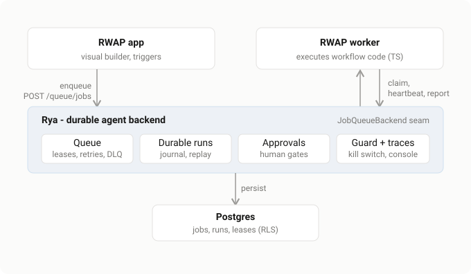
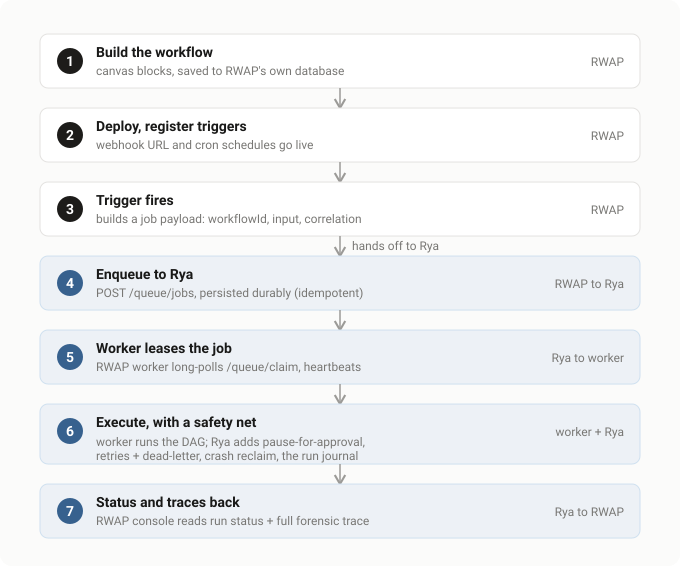
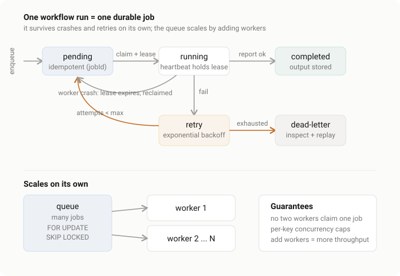
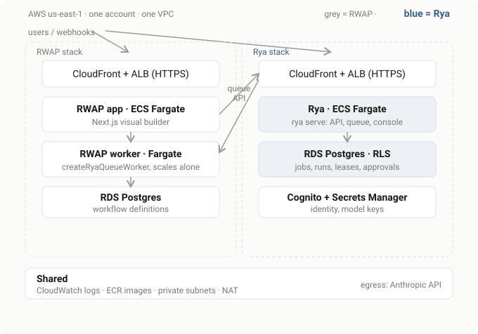

# RWAP on Rya

**RWAP** is the visual agent builder - the canvas where teams design and deploy
workflows. **Rya** is the durable backend those workflows run on. The split is
clean: RWAP owns *authoring*, Rya owns *running*, and the only coupling between
them is one HTTP boundary - Rya's queue API.

RWAP never adopts Python; Rya never touches the builder UI. RWAP gets durability,
approvals, retries, and observability without building any of it.

## System

RWAP's app and its workers talk to Rya over the queue API. Rya holds the durable
state on Postgres; RWAP's own workers execute the workflow code.

The seam is RWAP's existing `JobQueueBackend` abstraction - the `rya` backend is
one option alongside its database and trigger.dev backends, so adopting Rya is a
config switch, not a rewrite.

## What happens when a workflow is created

Steps 1 to 3 are pure RWAP (authoring). Steps 4 to 7 are Rya taking over
(running). The boundary is a single `POST /queue/jobs`.

1. **Build** - blocks on the canvas, saved to RWAP's own database. Rya is not
   involved in authoring.
2. **Deploy** - publishing registers the workflow's triggers (webhook URL, cron).
3. **Trigger fires** - a webhook, a schedule, or a manual run builds a job
   payload (`workflowId`, input, correlation) and routes it to the queue backend.
4. **Enqueue to Rya** - `POST /queue/jobs` with an idempotency key; Rya persists
   it to Postgres. From here the work cannot be lost.
5. **Worker leases it** - an RWAP worker long-polls `/queue/claim`, takes a
   lease, and heartbeats.
6. **Execute** - the worker runs the workflow's TypeScript DAG. Around it, Rya
   adds pause-for-approval, retries with backoff, dead-letter, crash reclaim, and
   the run journal.
7. **Status back** - complete/fail is reported to Rya; RWAP's console reads run
   status and the full trace.

## Every workflow run is durable, and scales on its own

Each triggered run is one durable job. It survives crashes and drives its own
retries; the queue as a whole scales just by adding workers.

**Durability (per job):**

- **Idempotent enqueue** - the `jobId` dedupes, so a retried trigger never
  double-runs a workflow.
- **Lease + heartbeat** - a claimed job is leased to one worker; the worker
  heartbeats to hold it.
- **Crash reclaim** - if the worker dies, the lease expires and the job returns
  to `pending` for another worker. A serve-embedded sweeper backstops this, so a
  stranded job finishes within one sweep interval.
- **Retry with backoff** - a failed attempt is rescheduled with exponential
  backoff until `maxAttempts`.
- **Dead-letter** - once attempts are exhausted the job lands in the DLQ for
  inspection and one-click replay, instead of vanishing.

**Independent scaling:**

- **No double-claims** - claiming uses `FOR UPDATE SKIP LOCKED`, so N workers
  pull from the same queue and never grab the same job.
- **Concurrency caps** - a `concurrencyKey` (for example, per tenant or per
  external API) caps how many same-key jobs run at once.
- **Throughput = workers** - the RWAP worker service is a separate ECS Fargate
  service, so you scale execution by adding worker tasks without touching the
  builder tier.

## On AWS

Both systems already deploy the same way - ECS Fargate (ARM64) fronting an ALB,
RDS Postgres for state - so this is two stacks in one account and VPC, bridged by
the queue API.

- **RWAP stack**: CloudFront + ALB, the `RWAP app` (Next.js) Fargate service, the
  `RWAP worker` Fargate service (runs `createRyaQueueWorker`, scales alone), and
  RDS Postgres for workflow definitions.
- **Rya stack**: CloudFront + ALB, `rya serve` on Fargate (API, queue, console),
  RDS Postgres with RLS (jobs, runs, leases, approvals), and Cognito + Secrets
  Manager for identity and model keys.
- **Shared**: CloudWatch logs, ECR images, private subnets with a NAT for egress
  to the Anthropic API.

In one VPC the worker-to-Rya queue traffic stays on the private network (internal
ALB or service discovery), so it never round-trips through CloudFront.

## Status and honest notes

- The integration is real and tested: the `backends/rya.ts` adapter and the
  `createRyaQueueWorker` loop were verified end to end against a live `rya serve`.
- Rya's stack in the AWS diagram mirrors the live `rya-live` CloudFormation
  stack; RWAP's mirrors its existing CDK deploy.
- Not shown, for clarity: RWAP's own Redis (still used for realtime/caching, but
  no longer load-bearing for job durability once the queue moves to Rya), and
  per-service autoscaling policies (a config detail, not a topology change).
- The durable-execution primitives are correct and tested but young - not yet
  load-tested at high volume.

See the [Rya queue module](../../src/rya/AGENTS.md) and the
[TypeScript client](../../clients/typescript/AGENTS.md) for the code.
